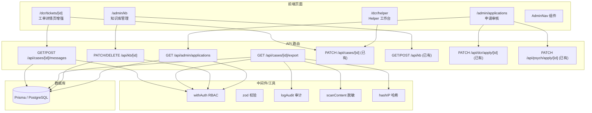
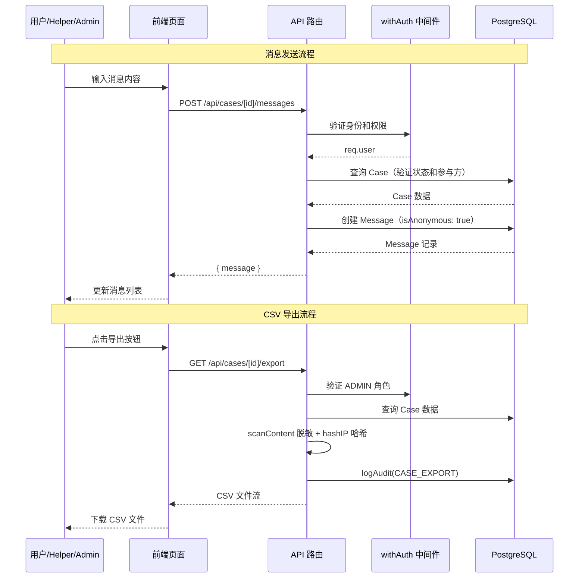

# 设计文档：DCR 互助系统完整 UI

## 概述

本设计文档覆盖 DCR 互助系统中缺失的前端 UI 功能及少量后端路由补全。系统基于 Next.js App Router + Prisma ORM + pnpm 技术栈，采用 `withAuth` RBAC 中间件进行权限控制，使用 zod 进行输入校验。

主要交付物包括：
1. 工单详情页增强（状态操作按钮 + 消息面板）
2. 消息 API 路由（GET/POST `/api/cases/[id]/messages`）
3. DCR_HELPER 工作台页面（`/dcr/helper`）
4. CSV 导出后端路由（GET `/api/cases/[id]/export`）
5. 知识库管理后台页面（`/admin/kb`）
6. 知识库文章编辑/删除 API（PATCH/DELETE `/api/kb/[id]`）
7. 准入申请审核页面（`/admin/applications`）
8. 准入申请列表 API（GET `/api/admin/applications`）
9. AdminNav 导航更新

设计原则：
- 复用现有 `withAuth` 中间件和 zod 校验器模式
- 前端使用 `"use client"` 组件 + `fetch` 调用 API
- 所有敏感操作记录审计日志
- 消息通信强制匿名（`isAnonymous: true`）

## 架构

### 整体架构图



### 路由权限矩阵

| 路由 | 方法 | 允许角色 | 额外条件 |
|------|------|----------|----------|
| `/api/cases/[id]/messages` | GET | 工单提交者/处理者/ADMIN | — |
| `/api/cases/[id]/messages` | POST | 工单提交者/处理者/ADMIN | 工单状态为 IN_PROGRESS 或 NEED_MORE_INFO |
| `/api/cases/[id]/export` | GET | ADMIN | — |
| `/api/kb/[id]` | PATCH | ADMIN | — |
| `/api/kb/[id]` | DELETE | ADMIN | — |
| `/api/admin/applications` | GET | ADMIN | 支持 type/status 筛选 |


## 组件与接口

### 1. CaseActionButtons 组件

位置：`src/components/dcr/CaseActionButtons.tsx`

职责：根据工单状态和当前用户角色/身份，渲染对应的操作按钮。

```typescript
interface CaseActionButtonsProps {
  caseId: string;
  status: CaseStatus;
  currentUserId: string;
  currentUserRole: string;
  submitterId: string;
  handlerId: string | null;
  onStatusChange: () => void; // 状态变更后的回调，用于刷新数据
}
```

纯函数（可测试）：
- `getAvailableActions(status, role, isSubmitter, isHandler): ActionConfig[]` — 根据状态和角色返回可用操作列表
- `ActionConfig = { label: string; targetStatus: CaseStatus; variant: ButtonVariant }`

按钮映射逻辑：
| 当前状态 | 角色/身份 | 按钮 | 目标状态 |
|----------|-----------|------|----------|
| OPENED | DCR_HELPER/ADMIN | 接单 | IN_PROGRESS |
| OPENED | 提交者 | 取消工单 | CLOSED |
| IN_PROGRESS | 处理者/ADMIN | 请求补充 | NEED_MORE_INFO |
| IN_PROGRESS | 处理者/ADMIN | 关闭工单 | CLOSED |
| NEED_MORE_INFO | 提交者/ADMIN | 已补充信息 | IN_PROGRESS |
| CLOSED | — | 无按钮 | — |

### 2. MessagePanel 组件

位置：`src/components/dcr/MessagePanel.tsx`

职责：工单内消息收发 UI，显示在工单详情页中。

```typescript
interface MessagePanelProps {
  caseId: string;
  currentUserId: string;
  caseStatus: CaseStatus;
}

interface MessageItem {
  id: string;
  content: string;
  isAnonymous: boolean;
  senderId: string;
  createdAt: string;
}
```

纯函数（可测试）：
- `formatMessageTime(dateStr: string): string` — 格式化为 `MM-DD HH:mm`
- `isOwnMessage(senderId: string, currentUserId: string): boolean` — 判断是否为自己发送的消息
- `canSendMessage(status: CaseStatus): boolean` — 判断当前状态是否允许发送消息（仅 IN_PROGRESS/NEED_MORE_INFO）

### 3. 消息 API 路由

位置：`src/app/api/cases/[id]/messages/route.ts`

**GET handler**：
- 使用 `withAuth` 中间件
- 查询 `prisma.case.findUnique` 验证工单存在及权限
- 查询 `prisma.message.findMany({ where: { caseId }, orderBy: { createdAt: 'asc' } })`
- 返回 `{ messages: MessageItem[] }`

**POST handler**：
- 使用 `withAuth` 中间件
- zod 校验 `{ content: z.string().min(1).max(2000) }`
- 验证工单状态为 IN_PROGRESS 或 NEED_MORE_INFO
- 确定 receiverId：如果发送者是提交者则 receiver 为处理者，反之亦然
- 创建 Message 记录，`isAnonymous: true`
- 返回 `{ message: MessageItem }`

### 4. HelperDashboard 页面

位置：`src/app/dcr/helper/page.tsx`

职责：DCR_HELPER 专属工作台，展示待接单和处理中工单。

```typescript
interface HelperDashboardData {
  openCases: CaseSummary[];      // 状态为 OPENED 的工单
  myCases: CaseSummary[];        // 当前用户为 handler 且状态为 IN_PROGRESS/NEED_MORE_INFO
  activeCount: number;           // myCases.length
  maxCases: number;              // 5
}

interface CaseSummary {
  id: string;
  category: string;
  status: string;
  createdAt: string;
}
```

纯函数（可测试）：
- `formatHelperCaseCount(active: number, max: number): string` — 返回 `"N/5"` 格式

数据获取：复用 `GET /api/cases` 路由（已有），通过查询参数筛选。或直接在页面组件中 fetch 两次：
- `GET /api/cases?status=OPENED` — 待接单
- `GET /api/cases?handlerId={userId}&status=IN_PROGRESS,NEED_MORE_INFO` — 我的处理中

权限控制：客户端检查 session role，非 DCR_HELPER/ADMIN 显示无权限提示。

### 5. CSV 导出路由

位置：`src/app/api/cases/[id]/export/route.ts`

**GET handler**：
- `withAuth(handler, "ADMIN")` — 仅 ADMIN
- 查询工单数据（含 formData）
- 对 formData 中所有文本值调用 `scanContent` 进行脱敏，将敏感词替换为 `[已脱敏]`
- 对 submitterId 调用 `hashIP` 进行哈希
- 生成 CSV 内容，头行：`id,category,status,formData,pledgeText,createdAt,submitterId`
- 设置响应头 `Content-Type: text/csv; charset=utf-8`，`Content-Disposition: attachment; filename="case-{id}.csv"`
- 调用 `logAudit(userId, AuditAction.CASE_EXPORT, ...)` 记录审计

纯函数（可测试）：
- `sanitizeFormData(formData: Record<string, string>, matches: SensitiveMatch[]): Record<string, string>` — 替换敏感词
- `buildCsvRow(caseData: CaseExportData): string` — 构建 CSV 行
- `escapeCsvField(value: string): string` — CSV 字段转义（处理逗号、引号、换行）

### 6. 知识库管理页面

位置：`src/app/admin/kb/page.tsx`

职责：Admin 管理知识库文章的 CRUD 界面。

交互流程：
1. 页面加载时 `GET /api/kb` 获取文章列表（Admin 可见所有，包括未发布的）
2. 点击「新建文章」→ 显示表单 → `POST /api/kb`
3. 点击「编辑」→ 预填表单 → `PATCH /api/kb/[id]`
4. 点击「删除」→ 确认对话框 → `DELETE /api/kb/[id]`

注意：现有 `GET /api/kb` 仅返回 `isPublished: true` 的文章。Admin 管理页需要看到所有文章（包括草稿）。设计决策：在 `GET /api/kb` 路由中增加 `all=true` 查询参数，当请求者为 ADMIN 时跳过 `isPublished` 过滤。

### 7. 知识库文章编辑/删除 API

位置：`src/app/api/kb/[id]/route.ts`

**PATCH handler**：
- `withAuth(handler, "ADMIN")`
- zod 校验使用已有的 `updateArticleSchema`
- `prisma.knowledgeArticle.update({ where: { id }, data })`

**DELETE handler**：
- `withAuth(handler, "ADMIN")`
- `prisma.knowledgeArticle.delete({ where: { id } })`
- 404 处理：Prisma `P2025` 错误码

### 8. 准入申请审核页面

位置：`src/app/admin/applications/page.tsx`

职责：Admin 审核 DCR 和心理区准入申请。

交互流程：
1. 页面加载时 `GET /api/admin/applications` 获取申请列表
2. Tab 切换 DCR/PSYCHOLOGY 类型筛选
3. 点击「通过」→ 调用 `PATCH /api/dcr/apply/[id]` 或 `PATCH /api/psych/apply/[id]`
4. 点击「拒绝」→ 显示备注输入 → 调用对应 API

### 9. 准入申请列表 API

位置：`src/app/api/admin/applications/route.ts`

**GET handler**：
- `withAuth(handler, "ADMIN")`
- 支持查询参数：`type`（DCR/PSYCHOLOGY）、`status`（PENDING/APPROVED/REJECTED）
- `prisma.accessApplication.findMany` + include `applicant: { select: { id, nickname } }`
- 按 `createdAt` 降序排列

### 10. AdminNav 更新

位置：`src/components/layout/AdminNav.tsx`

变更：在 `adminLinks` 数组中追加两项：
```typescript
{ href: "/admin/kb", label: "知识库", icon: BookOpen },
{ href: "/admin/applications", label: "准入审核", icon: ShieldCheck },
```

保持现有导航项和高亮逻辑不变。


## 数据模型

本设计不需要新增 Prisma 模型。所有需要的模型已存在：

### 已有模型（直接使用）

**Case**（工单）：
- `id`, `category`, `formData`, `status`, `pledgeText`, `createdAt`, `updatedAt`
- 关联：`submitter` (User), `handler` (User?), `timeline` (TimelineEvent[]), `messages` (Message[])

**Message**（消息）：
- `id`, `content`, `isAnonymous`, `createdAt`
- 关联：`sender` (User), `receiver` (User), `case_` (Case?)
- 用于工单内匿名通信

**TimelineEvent**（时间线事件）：
- `id`, `action`, `oldStatus`, `newStatus`, `details`, `createdAt`
- 关联：`case_` (Case)

**KnowledgeArticle**（知识库文章）：
- `id`, `title`, `content`, `category`, `visibility` (PUBLIC/DCR_ONLY), `isPublished`, `createdAt`, `updatedAt`

**AccessApplication**（准入申请）：
- `id`, `type` (DCR/PSYCHOLOGY), `status` (PENDING/APPROVED/REJECTED), `pledgeText`, `reviewNote`, `createdAt`, `reviewedAt`
- 关联：`applicant` (User)

**AuditLog**（审计日志）：
- `id`, `action`, `targetType`, `targetId`, `details`, `ipHash`, `createdAt`
- 关联：`operator` (User)

### 数据流图




## 正确性属性（Correctness Properties）

*属性（Property）是指在系统所有有效执行中都应成立的特征或行为——本质上是关于系统应该做什么的形式化陈述。属性是人类可读规格说明与机器可验证正确性保证之间的桥梁。*

### Property 1: 操作按钮与状态/角色的映射正确性

*For any* 工单状态（CaseStatus）、用户角色（Role）、是否为提交者（isSubmitter）、是否为处理者（isHandler）的组合，`getAvailableActions` 函数应返回且仅返回符合状态转换规则的操作按钮集合。具体而言：
- OPENED + DCR_HELPER/ADMIN → 包含「接单」
- OPENED + 提交者 → 包含「取消工单」
- IN_PROGRESS + 处理者/ADMIN → 包含「请求补充」和「关闭工单」
- NEED_MORE_INFO + 提交者/ADMIN → 包含「已补充信息」
- CLOSED → 空集合

**Validates: Requirements 1.1, 1.2, 1.3, 1.4, 1.9**

### Property 2: 消息发送状态守卫

*For any* CaseStatus 值，`canSendMessage(status)` 应返回 `true` 当且仅当 status 为 `IN_PROGRESS` 或 `NEED_MORE_INFO`。

**Validates: Requirements 2.1, 2.8**

### Property 3: 消息时间格式化

*For any* 有效的 ISO 日期字符串，`formatMessageTime` 应返回匹配 `MM-DD HH:mm` 格式的字符串。

**Validates: Requirements 2.9**

### Property 4: 消息归属判断

*For any* senderId 和 currentUserId，`isOwnMessage(senderId, currentUserId)` 应返回 `true` 当且仅当两者相等。

**Validates: Requirements 2.6**

### Property 5: 消息 API 访问控制

*For any* 用户和工单组合，`GET /api/cases/[id]/messages` 应仅在用户为工单提交者、处理者或 ADMIN 时返回 200；否则返回 401（未认证）或 403（无权限）。

**Validates: Requirements 3.2, 3.3, 3.4**

### Property 6: 消息创建字段自动赋值

*For any* 通过 `POST /api/cases/[id]/messages` 创建的消息，其 `senderId` 应等于当前用户 ID，`receiverId` 应等于工单中的对方（提交者或处理者），`caseId` 应等于当前工单 ID，`isAnonymous` 应为 `true`。

**Validates: Requirements 2.4, 3.6**

### Property 7: 消息内容长度校验

*For any* 长度超过 2000 字符的字符串作为 content 提交到 `POST /api/cases/[id]/messages`，API 应返回 400 错误。

**Validates: Requirements 3.5**

### Property 8: 非活跃状态禁止发送消息

*For any* 状态为 OPENED 或 CLOSED 的工单，`POST /api/cases/[id]/messages` 应返回 400 并提示「当前状态不允许发送消息」。

**Validates: Requirements 3.7**

### Property 9: 消息列表按时间升序排列

*For any* 工单的消息列表，`GET /api/cases/[id]/messages` 返回的消息应按 `createdAt` 升序排列。

**Validates: Requirements 2.5, 3.1**

### Property 10: Helper 工作台访问控制

*For any* 用户角色，Helper 工作台页面应仅对 DCR_HELPER 和 ADMIN 角色可见；其他角色应看到无权限提示。

**Validates: Requirements 4.2, 4.3**

### Property 11: Helper 工单计数格式

*For any* 非负整数 N 和最大值 5，`formatHelperCaseCount(N, 5)` 应返回字符串 `"N/5"`。

**Validates: Requirements 4.7**

### Property 12: CSV 导出仅限 ADMIN

*For any* 非 ADMIN 角色的用户，`GET /api/cases/[id]/export` 应返回 403 状态码。

**Validates: Requirements 5.2, 5.3**

### Property 13: CSV 导出数据脱敏

*For any* 工单数据，CSV 导出时 formData 中被 `scanContent` 检测到的敏感词应被替换为 `[已脱敏]`，且 submitterId 应被 `hashIP` 哈希处理后输出。

**Validates: Requirements 5.7, 5.8**

### Property 14: CSV 字段转义

*For any* 包含逗号、双引号或换行符的字符串，`escapeCsvField` 应正确转义使其符合 RFC 4180 CSV 标准（用双引号包裹，内部双引号转义为两个双引号）。

**Validates: Requirements 5.6**

### Property 15: 知识库文章更新校验

*For any* 通过 `PATCH /api/kb/[id]` 提交的更新，title 超过 200 字符或 content 超过 50000 字符时应返回 400；合法输入应成功更新对应字段。

**Validates: Requirements 7.1, 7.5**

### Property 16: 知识库 API 仅限 ADMIN

*For any* 非 ADMIN 角色的用户，`PATCH /api/kb/[id]` 和 `DELETE /api/kb/[id]` 应返回 403 状态码。

**Validates: Requirements 7.3**

### Property 17: 申请列表筛选正确性

*For any* type（DCR/PSYCHOLOGY）和 status（PENDING/APPROVED/REJECTED）筛选参数，`GET /api/admin/applications` 返回的所有申请记录应匹配指定的筛选条件。

**Validates: Requirements 9.2, 9.3**

### Property 18: 申请列表按时间降序排列

*For any* 申请列表，`GET /api/admin/applications` 返回的记录应按 `createdAt` 降序排列。

**Validates: Requirements 9.4**

### Property 19: 申请列表 API 仅限 ADMIN

*For any* 非 ADMIN 角色的用户，`GET /api/admin/applications` 应返回 403 状态码。

**Validates: Requirements 9.5, 9.6**

### Property 20: 审核按钮仅在 PENDING 状态显示

*For any* 准入申请，「通过」和「拒绝」按钮应仅在申请状态为 PENDING 时显示。

**Validates: Requirements 8.5**

### Property 21: AdminNav 保持现有导航项

*For any* AdminNav 渲染结果，原有的 5 个导航项（用户管理、内容管理、邀请码、操作日志、板块管理）应全部存在且链接正确。

**Validates: Requirements 10.3**

### Property 22: AdminNav 激活状态高亮

*For any* pathname，AdminNav 中 href 与 pathname 匹配的导航项应具有 `border-primary` 高亮样式，其余项不应具有该样式。

**Validates: Requirements 10.4**


## 错误处理

### API 路由错误处理

所有新增 API 路由遵循现有项目的错误处理模式：

| 错误场景 | HTTP 状态码 | 响应体 |
|----------|------------|--------|
| 未认证 | 401 | `{ error: "未登录" }` |
| 权限不足 | 403 | `{ error: "权限不足" }` |
| 资源不存在 | 404 | `{ error: "工单不存在" }` / `{ error: "文章不存在" }` |
| 参数校验失败 | 400 | `{ error: "参数校验失败", details: {...} }` |
| 业务规则违反 | 400 | `{ error: "当前状态不允许发送消息" }` |
| 服务器内部错误 | 500 | `{ error: "服务器内部错误" }` |

### 前端错误处理

- 所有 API 调用使用 try/catch 包裹
- 网络错误显示通用提示「网络错误，请检查连接后重试」
- API 返回的 error 字段直接展示给用户
- 状态操作按钮在请求期间禁用，防止重复提交
- 消息发送失败在发送按钮附近显示错误提示
- 删除操作前显示确认对话框，防止误操作

### Prisma 错误处理

- `P2025`（Record not found）→ 返回 404
- `P2002`（Unique constraint violation）→ 返回 409
- 其他 Prisma 错误 → 记录日志 + 返回 500

## 测试策略

### 属性测试（Property-Based Testing）

使用 `fast-check` 库进行属性测试，每个属性测试至少运行 100 次迭代。

每个属性测试必须通过注释引用设计文档中的属性编号：
```typescript
// Feature: dcr-complete-ui, Property 1: 操作按钮与状态/角色的映射正确性
```

属性测试覆盖的核心纯函数：
1. `getAvailableActions` — 按钮映射逻辑（Property 1）
2. `canSendMessage` — 消息发送状态守卫（Property 2）
3. `formatMessageTime` — 时间格式化（Property 3）
4. `isOwnMessage` — 消息归属判断（Property 4）
5. `escapeCsvField` — CSV 字段转义（Property 14）
6. `formatHelperCaseCount` — 工单计数格式（Property 11）

属性测试覆盖的 API 行为：
1. 消息 API 访问控制（Property 5）
2. 消息创建字段自动赋值（Property 6）
3. 消息内容长度校验（Property 7）
4. 非活跃状态禁止发送消息（Property 8）
5. 消息列表排序（Property 9）
6. CSV 导出权限（Property 12）
7. CSV 数据脱敏（Property 13）
8. 知识库更新校验（Property 15）
9. 知识库 API 权限（Property 16）
10. 申请列表筛选（Property 17）
11. 申请列表排序（Property 18）
12. 申请列表权限（Property 19）

### 单元测试

单元测试使用 Vitest，聚焦于具体示例和边界情况：

**API 路由测试**：
- `src/app/api/cases/[id]/messages/__tests__/route.test.ts` — 消息路由的 CRUD 和权限测试
- `src/app/api/cases/[id]/export/__tests__/route.test.ts` — CSV 导出路由测试
- `src/app/api/kb/[id]/__tests__/route.test.ts` — 知识库编辑/删除路由测试
- `src/app/api/admin/applications/__tests__/route.test.ts` — 申请列表路由测试

**页面/组件测试**：
- `src/components/dcr/__tests__/CaseActionButtons.test.ts` — 操作按钮组件测试
- `src/components/dcr/__tests__/MessagePanel.test.ts` — 消息面板组件测试
- `src/app/dcr/helper/__tests__/helper-page.test.ts` — Helper 工作台页面测试
- `src/app/admin/kb/__tests__/kb-admin-page.test.ts` — 知识库管理页面测试
- `src/app/admin/applications/__tests__/applications-page.test.ts` — 申请审核页面测试

**属性测试文件**：
- `src/app/api/cases/__tests__/messages.property.test.ts` — 消息相关属性测试
- `src/app/api/cases/__tests__/export.property.test.ts` — CSV 导出属性测试
- `src/components/dcr/__tests__/dcr-ui.property.test.ts` — DCR UI 纯函数属性测试

单元测试重点覆盖：
- 边界情况：空消息列表、不存在的工单、已关闭工单的操作
- 错误场景：网络错误、API 返回错误、Prisma 错误
- 集成点：按钮点击触发 API 调用、表单提交、页面导航
- AdminNav 新增导航项后的回归测试

### 测试配置

- 属性测试：每个 property 至少 100 次迭代
- 使用 `fast-check` 的 `fc.assert` + `fc.property`
- Mock Prisma client 和 `withAuth` 中间件用于 API 路由测试
- Mock `fetch` 用于前端组件测试
