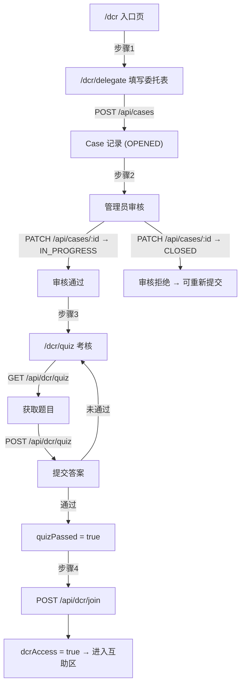

# 设计文档：DCR 四步互助流程改造

## 概述

本设计将 DCR 互助系统从现有的「准入申请 → 工单创建」两步流程，重构为「填写委托表 → 审核 → 考核 → 加入互助队伍」四步互助线。核心变更包括：

1. 用四步进度可视化替换现有 `/dcr` 入口页的简单申请按钮
2. 新增 `/dcr/delegate` 委托表页面，提供比现有工单表单更丰富的结构化字段（学校信息、举报途径、收费情况、诉求等）
3. 新增 `/dcr/quiz` 考核页面（教程学习 + 答题测试）
4. 新增 `POST /api/dcr/quiz`、`GET /api/dcr/quiz`、`POST /api/dcr/join` 三个 API 路由
5. 扩展 `DCRCategory` 枚举，新增 `EARLY_START`、`NO_WEEKENDS`、`EXTERNAL_TRAINING`

设计原则：最大化复用现有组件（WizardStepper、PrivacyBanner、SensitiveHighlight）和 API 模式（withAuth、zod 校验、Prisma 事务）。

## 架构

### 整体流程



### 页面路由结构

```
/dcr                    → 四步流程总览页（改造现有页面）
/dcr/delegate           → 委托表表单页（新增）
/dcr/quiz               → 考核页面（新增：教程 + 答题）
/dcr/tickets            → 工单列表（现有）
/dcr/tickets/new        → 新建工单向导（现有）
/dcr/tickets/[id]       → 工单详情（现有）
/dcr/helper             → Helper 面板（现有）
```

### API 路由结构

```
GET  /api/dcr/quiz      → 获取随机考核题目（新增）
POST /api/dcr/quiz      → 提交考核答案（新增）
POST /api/dcr/join      → 加入互助队伍（新增）
POST /api/cases         → 创建 Case（复用，委托表提交）
PATCH /api/cases/[id]   → 状态变更（复用，审核流程）
```

## 组件与接口

### 页面组件

#### 1. DCR 入口页改造 (`/dcr/page.tsx`)

改造现有入口页，替换准入申请逻辑为四步流程展示。

```typescript
// 用户流程状态判断逻辑
interface FlowState {
  step: 1 | 2 | 3 | 4;
  delegationCase: Case | null;    // 用户最新的委托表 Case
  quizPassed: boolean;
  dcrAccess: boolean;
  rejectionReason?: string;       // 审核拒绝原因
}

// 状态判断规则：
// step 1: 无 Case 或 Case 状态为 CLOSED（被拒绝后可重新提交）
// step 2: Case 状态为 OPENED（待审核）
// step 3: Case 状态为 IN_PROGRESS 且 quizPassed === false
// step 4: quizPassed === true（可加入或已加入）
```

复用 `WizardStepper` 组件展示四步进度。每步卡片包含编号、标题、描述和操作按钮。

#### 2. 委托表页面 (`/dcr/delegate/page.tsx`)

新建页面，使用 React Hook Form + zod 校验。表单分为 7 个区块：

- 内容类型（单选 radio group）
- 学校信息（名称、性质、类型、地址）
- 举报途径（多行文本）
- 详细描述（多行文本 + 可展开模板面板）
- 补课收费情况（单选 + 条件输入）
- 诉求（多选 checkbox group + 条件输入）
- 确认信息（3 个必选 checkbox）

#### 3. 考核页面 (`/dcr/quiz/page.tsx`)

新建页面，分两个阶段：

- 教程阶段：多章节内容，滚动阅读进度追踪，完成后解锁答题
- 答题阶段：5 道单选题，提交后显示结果

### 共享组件复用

| 组件 | 用途 |
|------|------|
| `WizardStepper` | 入口页四步进度条 |
| `PrivacyBanner` | 委托表页顶部隐私提醒 |
| `SensitiveHighlight` | 敏感信息高亮显示 |
| shadcn `Card`, `Button`, `Dialog` | 通用 UI |
| shadcn `RadioGroup`, `Checkbox`, `Textarea`, `Select` | 表单控件 |

### API 接口设计

#### GET /api/dcr/quiz

```typescript
// 请求：无 body，需要认证
// 前置条件：用户有 IN_PROGRESS 状态的 Case 且 quizPassed === false
// 响应 200:
{
  questions: Array<{
    id: string;
    text: string;
    options: Array<{ key: string; label: string }>;
  }>;
}
// 响应 409: { error: "已通过考核" }
// 响应 403: { error: "请先完成委托表审核" }
```

#### POST /api/dcr/quiz

```typescript
// 请求 body:
{
  answers: Array<{ questionId: string; selectedKey: string }>;
}
// 响应 200 (通过):
{
  passed: true;
  score: number;       // e.g. 5
  total: number;       // 5
}
// 响应 200 (未通过):
{
  passed: false;
  score: number;
  total: number;
  corrections: Array<{
    questionId: string;
    correctKey: string;
    explanation: string;
  }>;
}
```

#### POST /api/dcr/join

```typescript
// 请求：无 body，需要认证
// 前置条件：quizPassed === true
// 响应 200: { success: true }
// 响应 403: { error: "请先完成考核" }
// 响应 409: { error: "已加入互助队伍" }
```

### 委托表格式化输出

```typescript
interface DelegationFormData {
  contentType: ContentType;
  schoolName: string;
  schoolCategory: SchoolCategory;
  schoolType: SchoolType;
  schoolAddress: string;
  reportChannels: string;
  description: string;
  feeStatus: 'none' | 'charged' | 'unknown';
  feeDetails?: string;
  demands: string[];
  otherDemand?: string;
}

// 格式化函数（纯函数，可测试）
function formatDelegation(data: DelegationFormData): string {
  // 返回固定格式的文本
}
```


## 数据模型

### Prisma Schema 变更

#### 1. DCRCategory 枚举扩展

```prisma
enum DCRCategory {
  TUTORING          // 补课（现有）
  FEES              // 收费（现有）
  WEEKENDS          // 双休（现有）
  OTHER             // 其他（现有）
  EARLY_START       // 提前开学（新增）
  NO_WEEKENDS       // 不双休（新增）
  EXTERNAL_TRAINING // 校外培训（新增）
}
```

#### 2. User 模型（已有字段，无需变更）

`quizPassed` 和 `dcrAccess` 字段已存在于 User 模型中，直接使用。

#### 3. Case 模型（复用，无需变更）

委托表数据存储在 `Case.formData` (Json 字段) 中，结构如下：

```typescript
// Case.formData 的 JSON 结构
interface DelegationFormJson {
  contentType: string;       // 映射到 DCRCategory
  schoolName: string;
  schoolCategory: string;    // 公立学历制学校 | 私立学历制学校 | 校外培训机构
  schoolType: string;        // 小学 | 初级中学 | ...
  schoolAddress: string;
  reportChannels: string;
  description: string;
  feeStatus: string;         // none | charged | unknown
  feeDetails?: string;
  demands: string[];
  otherDemand?: string;
}
```

### 静态数据结构

#### 考核题库

```typescript
// src/lib/dcr-quiz-data.ts
interface QuizQuestion {
  id: string;
  text: string;
  options: Array<{ key: string; label: string }>;
  correctKey: string;
  explanation: string;
}

// 题库包含 10+ 道题，每次随机抽取 5 道
const QUIZ_QUESTIONS: QuizQuestion[] = [/* ... */];
```

#### 委托表枚举映射

```typescript
// src/lib/dcr-delegation-types.ts

// 内容类型 → DCRCategory 映射
const CONTENT_TYPE_MAP: Record<string, DCRCategory> = {
  '学校补课类': 'TUTORING',
  '学校提前开学类': 'EARLY_START',
  '学校不双休类': 'NO_WEEKENDS',
  '校外培训机构类': 'EXTERNAL_TRAINING',
  '其他': 'OTHER',
};

// 学校性质 → 学校类型选项映射
const SCHOOL_TYPE_OPTIONS: Record<string, string[]> = {
  '公立学历制学校': ['小学', '初级中学', '高级中学', '职业技术学校', '技工学校', '中等专业学校', '普通高校'],
  '私立学历制学校': ['小学', '初级中学', '高级中学', '职业技术学校', '技工学校', '中等专业学校', '普通高校'],
  '校外培训机构': ['校外培训机构'],
};

// 诉求选项
const DEMAND_OPTIONS = [
  '停止补课',
  '退还费用',
  '要求教育局暗访',
  '按照正常时间开学',
  '对相关人员作出处理',
  '其他',
];

// 模板列表
const DESCRIPTION_TEMPLATES: Record<string, string> = {
  '补课': '...',
  '提前开学': '...',
  '政策允许补课但违规提前开学': '...',
  '校外培训机构': '...',
  '不双休': '...',
};
```

### Zod 校验 Schema

```typescript
// 委托表提交校验
const delegationFormSchema = z.object({
  contentType: z.enum(['学校补课类', '学校提前开学类', '学校不双休类', '校外培训机构类', '其他']),
  schoolName: z.string().min(1, '学校名称不能为空').max(100),
  schoolCategory: z.enum(['公立学历制学校', '私立学历制学校', '校外培训机构']),
  schoolType: z.string().min(1, '请选择学校类型'),
  schoolAddress: z.string().min(1, '学校地址不能为空').max(200),
  reportChannels: z.string().max(500).optional(),
  description: z.string().min(20, '详细描述至少 20 字').max(5000),
  feeStatus: z.enum(['none', 'charged', 'unknown']),
  feeDetails: z.string().max(500).optional(),
  demands: z.array(z.string()).min(1, '请至少选择一项诉求'),
  otherDemand: z.string().max(500).optional(),
  confirmations: z.tuple([z.literal(true), z.literal(true), z.literal(true)]),
});

// 考核答案提交校验
const quizAnswerSchema = z.object({
  answers: z.array(z.object({
    questionId: z.string(),
    selectedKey: z.string(),
  })).length(5),
});
```


## 正确性属性（Correctness Properties）

*属性（Property）是指在系统所有合法执行中都应成立的特征或行为——本质上是对系统应做什么的形式化陈述。属性是人类可读规格说明与机器可验证正确性保证之间的桥梁。*

### Property 1: 流程状态计算正确性

*For any* 用户状态组合（Case 状态、quizPassed、dcrAccess），流程状态计算函数应返回正确的步骤编号：无 Case 或 Case 为 CLOSED → 步骤 1；Case 为 OPENED → 步骤 2；Case 为 IN_PROGRESS 且 quizPassed=false → 步骤 3；quizPassed=true → 步骤 4。

**Validates: Requirements 1.2, 1.3, 1.4, 1.5, 5.3**

### Property 2: 学校类型选项依赖学校性质

*For any* 学校性质选择值，返回的学校类型选项列表应与预定义映射表完全一致，且不同学校性质返回的选项列表符合各自的定义。

**Validates: Requirements 2.5**

### Property 3: 描述字段最小长度校验

*For any* 长度小于 20 的字符串作为详细描述字段，表单校验应拒绝该输入；*For any* 长度 ≥ 20 的非空字符串，校验应通过。

**Validates: Requirements 2.7**

### Property 4: 确认复选框全选校验

*For any* 三个布尔值的组合，仅当全部为 true 时表单校验通过；任何包含 false 的组合应被拒绝。

**Validates: Requirements 2.14**

### Property 5: 敏感内容阻止提交

*For any* 委托表表单数据，提交是否被允许应当且仅当所有文本字段均未检测到敏感信息。检测到敏感信息时应阻止提交并标识敏感内容位置。

**Validates: Requirements 3.3, 3.4, 3.5**

### Property 6: 格式化输出包含所有必填字段

*For any* 合法的 DelegationFormData，formatDelegation 函数的输出字符串应包含：声明文本、学校名称、性质-类型、地址、举报途径、行为描述、收费情况、诉求列表、生成时间。

**Validates: Requirements 4.3**

### Property 7: 委托表提交创建 OPENED 状态 Case

*For any* 通过校验的委托表数据，提交后创建的 Case 记录状态应为 OPENED，且 formData 中存储的数据与提交数据一致（round-trip）。

**Validates: Requirements 4.1, 5.1**

### Property 8: 考核页面访问控制

*For any* 用户，GET /api/dcr/quiz 仅在用户拥有 IN_PROGRESS 状态的 Case 且 quizPassed=false 时返回 200；quizPassed=true 时返回 409；无审核通过的 Case 时返回 403。

**Validates: Requirements 6.2, 6.3, 8.2, 8.5**

### Property 9: 考核题目选取正确性

*For any* 对 GET /api/dcr/quiz 的合法请求，返回的题目数量应恰好为 5，每道题应属于题库子集，且响应中不应包含 correctKey 字段。

**Validates: Requirements 7.1, 7.6, 8.1**

### Property 10: 考核评分正确性

*For any* 5 道题的答案组合，评分结果应满足：正确数 ≥ 4 时 passed=true 且不返回 corrections；正确数 < 4 时 passed=false 且 corrections 仅包含答错题目的正确答案和解析。

**Validates: Requirements 7.2, 7.4, 7.5, 8.4**

### Property 11: 加入互助队伍端点守卫

*For any* 用户，POST /api/dcr/join 仅在 quizPassed=true 且 dcrAccess=false 时成功并设置 dcrAccess=true；quizPassed=false 时返回 403；dcrAccess=true 时返回 409。

**Validates: Requirements 9.1, 9.2, 9.3, 9.4**

### Property 12: 内容类型到 DCRCategory 映射正确性

*For any* 委托表内容类型选项值，映射函数应返回对应的 DCRCategory 枚举值，且映射关系覆盖所有 5 种内容类型。

**Validates: Requirements 10.3**

## 错误处理

### 表单校验错误

| 场景 | 处理方式 |
|------|----------|
| 必填字段为空 | 字段下方显示红色错误提示，阻止提交 |
| 描述少于 20 字 | 显示「详细描述至少 20 字」 |
| 确认复选框未全选 | 提交按钮禁用，提示「请确认所有声明」 |
| 敏感信息检测 | 阻止提交，使用 SensitiveHighlight 高亮敏感内容 |

### API 错误

| 端点 | 状态码 | 场景 |
|------|--------|------|
| POST /api/cases | 400 | 表单数据校验失败 |
| POST /api/cases | 401 | 未登录 |
| GET /api/dcr/quiz | 403 | 委托表未审核通过 |
| GET /api/dcr/quiz | 409 | 已通过考核 |
| POST /api/dcr/quiz | 400 | 答案格式错误 |
| POST /api/dcr/quiz | 403 | 无权访问 |
| POST /api/dcr/join | 403 | 未通过考核 |
| POST /api/dcr/join | 409 | 已加入互助队伍 |
| 所有端点 | 500 | 服务器内部错误 |

### 网络错误

所有 API 调用使用 try/catch 包裹，网络错误时显示通用错误提示「网络错误，请检查连接后重试」。

## 测试策略

### 双重测试方法

本功能采用单元测试 + 属性测试的双重策略：

- **单元测试**：验证具体示例、边界情况和错误条件
- **属性测试**：验证跨所有输入的通用属性

### 属性测试配置

- 使用 `fast-check` 作为属性测试库（项目已有依赖）
- 每个属性测试至少运行 100 次迭代
- 每个测试用注释标注对应的设计属性
- 标注格式：**Feature: dcr-mutual-aid-flow, Property {number}: {property_text}**
- 每个正确性属性由一个属性测试实现

### 测试分类

#### 属性测试（Property-Based Tests）

| 属性 | 测试文件 | 说明 |
|------|----------|------|
| P1 流程状态计算 | `src/lib/__tests__/dcr-flow.property.test.ts` | 生成随机用户状态组合，验证步骤计算 |
| P2 学校类型映射 | `src/lib/__tests__/dcr-delegation.property.test.ts` | 遍历所有学校性质，验证类型选项 |
| P3 描述长度校验 | `src/lib/__tests__/dcr-delegation.property.test.ts` | 生成随机长度字符串，验证校验结果 |
| P4 确认复选框校验 | `src/lib/__tests__/dcr-delegation.property.test.ts` | 生成所有布尔组合，验证校验结果 |
| P5 敏感内容阻止 | `src/lib/__tests__/dcr-delegation.property.test.ts` | 生成含/不含敏感词的表单数据 |
| P6 格式化输出 | `src/lib/__tests__/dcr-delegation.property.test.ts` | 生成随机表单数据，验证输出包含所有字段 |
| P7 Case 创建 | `src/app/api/dcr/__tests__/delegation.property.test.ts` | 生成随机表单数据，验证 Case 创建 |
| P8 考核访问控制 | `src/app/api/dcr/__tests__/quiz.property.test.ts` | 生成随机用户状态，验证访问控制 |
| P9 题目选取 | `src/app/api/dcr/__tests__/quiz.property.test.ts` | 多次请求，验证题目数量和无答案泄露 |
| P10 评分正确性 | `src/app/api/dcr/__tests__/quiz.property.test.ts` | 生成随机答案组合，验证评分逻辑 |
| P11 加入守卫 | `src/app/api/dcr/__tests__/join.property.test.ts` | 生成随机用户状态，验证端点行为 |
| P12 类别映射 | `src/lib/__tests__/dcr-delegation.property.test.ts` | 遍历所有内容类型，验证映射 |

#### 单元测试（Unit Tests）

| 测试文件 | 覆盖内容 |
|----------|----------|
| `src/app/dcr/__tests__/dcr-flow-page.test.ts` | 入口页渲染、进度条、按钮状态 |
| `src/app/dcr/delegate/__tests__/delegate-page.test.ts` | 委托表表单渲染、条件字段、模板面板 |
| `src/app/dcr/quiz/__tests__/quiz-page.test.ts` | 考核页面渲染、教程进度、答题交互 |
| `src/app/api/dcr/__tests__/quiz.test.ts` | Quiz API 路由具体场景 |
| `src/app/api/dcr/__tests__/join.test.ts` | Join API 路由具体场景 |

