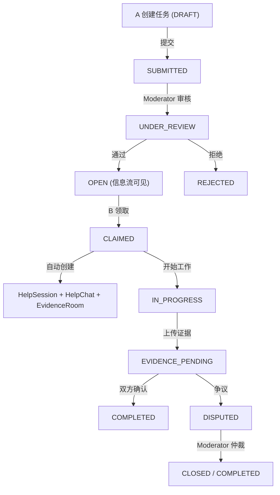

# 设计文档：DCR 互助任务闭环系统

## 概述

在现有 DCR 四步互助流程基础上，新增完整的互助任务闭环功能。核心变更：

1. 新增 6 个 Prisma 模型：MutualAidTask、HelpSession、HelpChat、HelpChatMessage、EvidenceRoom、EvidenceItem、ModerationAction
2. 新增 TaskStatus（11 个状态）和 EvidenceItemType（4 种）枚举
3. 新增 ~15 个 API 路由覆盖任务 CRUD、领取、私聊、证据管理、结案、争议
4. 新增 6 个前端页面：任务信息流、任务详情、HelpChat、EvidenceRoom、管理后台审核/争议队列
5. 复用现有 withAuth、rate-limiter、audit、sensitive-engine、OSS 模块

设计原则：最大化复用现有基础设施，状态机逻辑抽取为纯函数便于测试。

## 架构

### 整体流程



### 页面路由结构

```
/dcr/tasks                → 互助任务信息流（新增）
/dcr/tasks/new            → 创建互助任务（新增）
/dcr/tasks/[id]           → 任务详情页（新增）
/dcr/tasks/[id]/chat      → HelpChat 私聊页（新增）
/dcr/tasks/[id]/evidence  → EvidenceRoom 证据空间（新增）
/admin/tasks              → 任务审核队列（新增）
/admin/disputes           → 争议队列（新增）
```

### API 路由结构

```
POST   /api/dcr/tasks              → 创建任务
GET    /api/dcr/tasks              → 任务列表（信息流，支持 tab 筛选）
GET    /api/dcr/tasks/[id]         → 任务详情
PATCH  /api/dcr/tasks/[id]         → 更新任务状态（提交/审核/拒绝等）
POST   /api/dcr/tasks/[id]/claim   → 领取任务
POST   /api/dcr/tasks/[id]/close   → 申请结案/确认完成
POST   /api/dcr/tasks/[id]/dispute → 发起争议

GET    /api/dcr/tasks/[id]/chat           → 获取聊天消息
POST   /api/dcr/tasks/[id]/chat           → 发送聊天消息
POST   /api/dcr/tasks/[id]/chat/[msgId]/mark-evidence → 标记消息为证据

GET    /api/dcr/tasks/[id]/evidence       → 获取证据条目列表
POST   /api/dcr/tasks/[id]/evidence       → 上传/创建证据条目
GET    /api/dcr/tasks/[id]/evidence/[itemId]/url → 获取文件签名 URL

GET    /api/admin/tasks            → 管理后台任务审核队列
GET    /api/admin/disputes         → 管理后台争议队列
POST   /api/admin/disputes/[id]    → 处理争议（仲裁操作）
```

## 组件与接口

### 状态机纯函数

```typescript
// src/lib/task-state-machine.ts

export type TaskStatus =
  | 'DRAFT' | 'SUBMITTED' | 'UNDER_REVIEW' | 'OPEN'
  | 'CLAIMED' | 'IN_PROGRESS' | 'EVIDENCE_PENDING'
  | 'COMPLETED' | 'REJECTED' | 'CLOSED' | 'DISPUTED';

// 正向转移规则
const FORWARD_TRANSITIONS: Record<TaskStatus, TaskStatus[]> = {
  DRAFT: ['SUBMITTED'],
  SUBMITTED: ['UNDER_REVIEW'],
  UNDER_REVIEW: ['OPEN'],
  OPEN: ['CLAIMED'],
  CLAIMED: ['IN_PROGRESS'],
  IN_PROGRESS: ['EVIDENCE_PENDING'],
  EVIDENCE_PENDING: ['COMPLETED'],
  COMPLETED: [],
  REJECTED: [],
  CLOSED: [],
  DISPUTED: [],
};

// 终态（可从任意状态转入）
const TERMINAL_STATES: TaskStatus[] = ['REJECTED', 'CLOSED', 'DISPUTED'];

export function canTransition(from: TaskStatus, to: TaskStatus): boolean {
  if (TERMINAL_STATES.includes(to)) return true;
  return FORWARD_TRANSITIONS[from]?.includes(to) ?? false;
}

export function getNextStates(current: TaskStatus): TaskStatus[] {
  return [...(FORWARD_TRANSITIONS[current] ?? []), ...TERMINAL_STATES];
}
```

### 结案验证纯函数

```typescript
// src/lib/task-completion.ts

export interface CompletionCheck {
  canComplete: boolean;
  missingProcess: boolean;  // 缺少过程证据
  missingOutcome: boolean;  // 缺少结果/回访
}

export function checkCompletionRequirements(
  evidenceItems: Array<{ type: string }>
): CompletionCheck {
  const hasProcess = evidenceItems.some(
    e => e.type === 'EVIDENCE_ITEM' || e.type === 'NOTE'
  );
  const hasOutcome = evidenceItems.some(
    e => e.type === 'OUTCOME' || e.type === 'FOLLOW_UP'
  );
  return {
    canComplete: hasProcess && hasOutcome,
    missingProcess: !hasProcess,
    missingOutcome: !hasOutcome,
  };
}
```

### API 接口设计

#### POST /api/dcr/tasks — 创建任务

```typescript
// Request
{
  title: string;
  category: DCRCategory;
  summary: string;
  expectedHelpType: string;
  urgencyLevel: 'LOW' | 'MEDIUM' | 'HIGH' | 'URGENT';
  structuredFields: {
    dateRange?: { start: string; end: string };
    locationGranularity?: 'CITY' | 'DISTRICT';
    helpCategory?: 'POLICY_CONSULT' | 'COMMUNICATION_TEMPLATE' | 'MATERIAL_PREP' | 'OTHER';
  };
}
// Response 201
{ id: string; status: 'DRAFT' }
```

#### PATCH /api/dcr/tasks/[id] — 更新任务状态

```typescript
// Request
{ action: 'submit' | 'review' | 'approve' | 'reject'; reason?: string }
// Response 200
{ id: string; status: TaskStatus }
```

#### POST /api/dcr/tasks/[id]/claim — 领取任务

```typescript
// Response 200
{ sessionId: string; chatId: string; evidenceRoomId: string }
// Response 409: { error: "任务已被领取" }
// Response 403: { error: "无权限" }
```

#### POST /api/dcr/tasks/[id]/chat — 发送消息

```typescript
// Request
{ content: string; quotedMessageId?: string; fileUrl?: string }
// Response 201
{ id: string; content: string; createdAt: string }
```

#### POST /api/dcr/tasks/[id]/evidence — 创建证据条目

```typescript
// Request (multipart or JSON)
{
  type: 'EVIDENCE_ITEM' | 'NOTE' | 'OUTCOME' | 'FOLLOW_UP';
  description: string;
  fileUrl?: string;           // 文件类型条目
  sensitiveConfirmed: boolean; // 必须为 true
}
// Response 201
{ id: string; type: string; createdAt: string }
```

#### POST /api/dcr/tasks/[id]/close — 申请结案

```typescript
// Request
{ action: 'request' | 'confirm' | 'force'; reason?: string }
// Response 200
{ status: TaskStatus; completionReport?: CompletionReport }
```

#### POST /api/dcr/tasks/[id]/dispute — 发起争议

```typescript
// Request
{ explanation: string }
// Response 200
{ status: 'DISPUTED' }
```

### 共享组件复用

| 组件 | 用途 |
|------|------|
| `PrivacyBanner` | HelpChat 和 EvidenceRoom 页面顶部隐私提醒 |
| `SensitiveHighlight` | 聊天内容和证据描述敏感信息高亮 |
| `TimelineView` | 任务详情页状态时间线 |
| `MessagePanel` | HelpChat 消息面板（复用现有 DCR 消息组件模式） |
| shadcn `Card`, `Tabs`, `Badge`, `Dialog` | 通用 UI |

## 数据模型

### Prisma Schema 新增

```prisma
// ==================== 互助任务状态 ====================

enum TaskStatus {
  DRAFT
  SUBMITTED
  UNDER_REVIEW
  OPEN
  CLAIMED
  IN_PROGRESS
  EVIDENCE_PENDING
  COMPLETED
  REJECTED
  CLOSED
  DISPUTED
}

enum UrgencyLevel {
  LOW
  MEDIUM
  HIGH
  URGENT
}

enum EvidenceItemType {
  EVIDENCE_ITEM   // 截图/录音/文件
  NOTE            // 文字说明
  OUTCOME         // 处理结果
  FOLLOW_UP       // 回访记录
}

// ==================== 互助任务 ====================

model MutualAidTask {
  id                String       @id @default(cuid())
  title             String
  category          DCRCategory
  summary           String
  expectedHelpType  String
  urgencyLevel      UrgencyLevel @default(MEDIUM)
  structuredFields  Json         // { dateRange, locationGranularity, helpCategory }
  attachments       String[]     // 附件 URL 数组
  riskFlags         Json?        // 风险标记数组
  status            TaskStatus   @default(DRAFT)
  rejectionReason   String?
  closureReason     String?
  completionReport  Json?        // 结案报告
  requesterConfirmed Boolean     @default(false)
  helperConfirmed    Boolean     @default(false)
  createdAt         DateTime     @default(now())
  updatedAt         DateTime     @updatedAt

  requesterId       String
  requester         User         @relation("TaskRequester", fields: [requesterId], references: [id])

  helpSession       HelpSession?
  timeline          TaskTimelineEvent[]

  @@index([status])
  @@index([requesterId])
  @@index([urgencyLevel])
  @@index([createdAt])
}

model TaskTimelineEvent {
  id        String     @id @default(cuid())
  action    String
  oldStatus String?
  newStatus String?
  details   String?
  createdAt DateTime   @default(now())

  taskId    String
  task      MutualAidTask @relation(fields: [taskId], references: [id], onDelete: Cascade)
  operatorId String?

  @@index([taskId])
}

// ==================== 互助会话 ====================

model HelpSession {
  id          String   @id @default(cuid())
  createdAt   DateTime @default(now())
  closedAt    DateTime?

  taskId      String   @unique
  task        MutualAidTask @relation(fields: [taskId], references: [id])

  helperId    String
  requesterId String

  helpChat     HelpChat?
  evidenceRoom EvidenceRoom?
}

// ==================== 私聊 ====================

model HelpChat {
  id        String   @id @default(cuid())
  createdAt DateTime @default(now())

  sessionId String   @unique
  session   HelpSession @relation(fields: [sessionId], references: [id], onDelete: Cascade)

  messages  HelpChatMessage[]
}

model HelpChatMessage {
  id              String   @id @default(cuid())
  content         String
  fileUrl         String?
  quotedMessageId String?
  isSystemMessage Boolean  @default(false)
  isEvidence      Boolean  @default(false)  // 标记为证据候选
  createdAt       DateTime @default(now())

  chatId   String
  chat     HelpChat @relation(fields: [chatId], references: [id], onDelete: Cascade)
  senderId String

  @@index([chatId, createdAt])
}

// ==================== 证据空间 ====================

model EvidenceRoom {
  id        String   @id @default(cuid())
  createdAt DateTime @default(now())

  sessionId String   @unique
  session   HelpSession @relation(fields: [sessionId], references: [id], onDelete: Cascade)

  items     EvidenceItem[]
}

model EvidenceItem {
  id          String           @id @default(cuid())
  type        EvidenceItemType
  description String
  fileUrl     String?          // 对象存储 key
  fileName    String?
  fileSize    Int?
  createdAt   DateTime         @default(now())

  roomId      String
  room        EvidenceRoom @relation(fields: [roomId], references: [id], onDelete: Cascade)
  uploaderId  String

  @@index([roomId, type])
}

// ==================== 管理处置 ====================

model ModerationAction {
  id          String   @id @default(cuid())
  actionType  String   // TAKEDOWN / REPLACE_HELPER / BAN_USER / DISMISS_DISPUTE / FREEZE
  targetType  String   // TASK / CHAT_MESSAGE / EVIDENCE_ITEM / USER
  targetId    String
  reason      String
  details     Json?
  createdAt   DateTime @default(now())

  operatorId  String

  @@index([targetType, targetId])
  @@index([operatorId])
  @@index([createdAt])
}
```

### User 模型关联追加

```prisma
// 在 User 模型中追加：
tasksRequested  MutualAidTask[] @relation("TaskRequester")
```

### 索引建议

| 模型 | 索引 | 用途 |
|------|------|------|
| MutualAidTask | `[status]` | 按状态筛选（信息流、审核队列） |
| MutualAidTask | `[requesterId]` | 用户的任务列表 |
| MutualAidTask | `[urgencyLevel]` | 紧急度排序 |
| MutualAidTask | `[createdAt]` | 时间排序 |
| TaskTimelineEvent | `[taskId]` | 任务时间线查询 |
| HelpChatMessage | `[chatId, createdAt]` | 聊天消息分页 |
| EvidenceItem | `[roomId, type]` | 按类型分栏查询 |
| ModerationAction | `[targetType, targetId]` | 按目标查询处置记录 |
| ModerationAction | `[operatorId]` | 按操作者查询 |

## Zod 校验 Schema

```typescript
// src/lib/validators.ts 追加

export const urgencyLevelSchema = z.enum(['LOW', 'MEDIUM', 'HIGH', 'URGENT']);

export const evidenceItemTypeSchema = z.enum(['EVIDENCE_ITEM', 'NOTE', 'OUTCOME', 'FOLLOW_UP']);

export const createTaskSchema = z.object({
  title: z.string().min(1, '标题不能为空').max(100),
  category: dcrCategorySchema,
  summary: z.string().min(10, '摘要至少 10 字').max(2000),
  expectedHelpType: z.string().min(1).max(200),
  urgencyLevel: urgencyLevelSchema.default('MEDIUM'),
  structuredFields: z.object({
    dateRange: z.object({
      start: z.string(),
      end: z.string(),
    }).optional(),
    locationGranularity: z.enum(['CITY', 'DISTRICT']).optional(),
    helpCategory: z.enum(['POLICY_CONSULT', 'COMMUNICATION_TEMPLATE', 'MATERIAL_PREP', 'OTHER']).optional(),
  }).default({}),
});

export const taskActionSchema = z.object({
  action: z.enum(['submit', 'review', 'approve', 'reject']),
  reason: z.string().max(1000).optional(),
});

export const sendChatMessageSchema = z.object({
  content: z.string().min(1, '消息不能为空').max(5000),
  quotedMessageId: z.string().cuid().optional(),
  fileUrl: z.string().url().optional(),
});

export const createEvidenceItemSchema = z.object({
  type: evidenceItemTypeSchema,
  description: z.string().min(1, '描述不能为空').max(5000),
  fileUrl: z.string().optional(),
  fileName: z.string().optional(),
  fileSize: z.number().int().positive().optional(),
  sensitiveConfirmed: z.literal(true, { errorMap: () => ({ message: '请确认敏感信息声明' }) }),
});

export const closeTaskSchema = z.object({
  action: z.enum(['request', 'confirm', 'force']),
  reason: z.string().max(1000).optional(),
});

export const disputeTaskSchema = z.object({
  explanation: z.string().min(10, '争议说明至少 10 字').max(5000),
});

export const moderateDisputeSchema = z.object({
  action: z.enum(['takedown', 'replace_helper', 'ban_user', 'dismiss', 'freeze']),
  reason: z.string().min(1).max(1000),
  targetUserId: z.string().cuid().optional(),
});
```

## 正确性属性（Correctness Properties）

### Property 1: 状态机转移合法性

*For any* 当前状态和目标状态的组合，canTransition 函数应仅在合法转移路径上返回 true：正向转移链（DRAFT→SUBMITTED→...→COMPLETED）和终态转移（任意→REJECTED/CLOSED/DISPUTED）。

**Validates: Requirements 2.1, 2.2, 2.3**

### Property 2: 领取互斥性

*For any* OPEN 状态的任务，同一时间仅允许一个用户成功领取（CLAIMED），并发领取请求中仅一个成功。

**Validates: Requirements 2.5**

### Property 3: CLAIMED 自动创建关联资源

*For any* 成功领取操作，系统应同时创建 HelpSession、HelpChat 和 EvidenceRoom 三个关联记录。

**Validates: Requirements 2.6, 3.1, 3.2, 4.1**

### Property 4: HelpChat 访问控制

*For any* HelpChat 访问请求，仅当请求者为 A（requester）、B（helper）或 Moderator/Admin 时允许访问，其他用户返回 403。

**Validates: Requirements 3.7**

### Property 5: EvidenceRoom 访问控制

*For any* EvidenceRoom 访问请求，仅当请求者为 A、B 或 Moderator/Admin 时允许访问。

**Validates: Requirements 4.2, 4.8**

### Property 6: 结案证据完整性

*For any* 进入 COMPLETED 状态的任务，其 EvidenceRoom 应至少包含 1 个过程证据（EVIDENCE_ITEM 或 NOTE）和 1 个结果/回访条目（OUTCOME 或 FOLLOW_UP）。

**Validates: Requirements 5.4**

### Property 7: 双方确认结案

*For any* EVIDENCE_PENDING 状态的任务，仅当 requesterConfirmed=true 且 helperConfirmed=true 时方可转移到 COMPLETED（或 Moderator 强制结案）。

**Validates: Requirements 5.1, 5.2, 5.3**

### Property 8: 信誉积分变更正确性

*For any* 成功完成的互助任务，B 的 reputationScore 应增加；*For any* DISPUTED 任务，违规方的 reputationScore 应减少。

**Validates: Requirements 5.6, 5.7, 5.8**

### Property 9: 证据上传敏感确认

*For any* 证据条目创建请求，sensitiveConfirmed 必须为 true，否则拒绝创建。

**Validates: Requirements 4.4**

### Property 10: 审计日志完整性

*For any* EvidenceRoom 的访问、下载或导出操作，系统应写入对应的 audit_log 记录。

**Validates: Requirements 4.7**

## 错误处理

### API 错误

| 端点 | 状态码 | 场景 |
|------|--------|------|
| POST /api/dcr/tasks | 400 | 表单校验失败 |
| POST /api/dcr/tasks | 403 | 无 dcrAccess |
| PATCH /api/dcr/tasks/[id] | 400 | 非法状态转移 |
| PATCH /api/dcr/tasks/[id] | 403 | 无权限操作 |
| POST /api/dcr/tasks/[id]/claim | 409 | 任务已被领取 |
| POST /api/dcr/tasks/[id]/claim | 403 | 无 dcrAccess |
| GET /api/dcr/tasks/[id]/chat | 403 | 非参与方 |
| POST /api/dcr/tasks/[id]/chat | 429 | 频率限制 |
| POST /api/dcr/tasks/[id]/evidence | 400 | sensitiveConfirmed 未确认 |
| POST /api/dcr/tasks/[id]/close | 400 | 证据不完整 |
| POST /api/dcr/tasks/[id]/dispute | 400 | 说明不足 |
| 所有端点 | 401 | 未登录 |
| 所有端点 | 500 | 服务器内部错误 |

### 风控触发

| 场景 | 处理 |
|------|------|
| 高风险关键词检测 | 任务/消息冻结，进入强制审核 |
| 频率超限 | 返回 429，提示稍后重试 |
| 举报 | 创建 Report 记录，关联 targetType |

## 测试策略

### 属性测试

| 属性 | 测试文件 | 说明 |
|------|----------|------|
| P1 状态机转移 | `src/lib/__tests__/task-state-machine.property.test.ts` | 生成随机状态对，验证转移合法性 |
| P2 领取互斥 | `src/app/api/dcr/tasks/__tests__/claim.property.test.ts` | 模拟并发领取 |
| P3 CLAIMED 创建资源 | `src/app/api/dcr/tasks/__tests__/claim.property.test.ts` | 验证三个关联记录 |
| P4 HelpChat 访问控制 | `src/app/api/dcr/tasks/__tests__/chat.property.test.ts` | 生成随机用户角色 |
| P5 EvidenceRoom 访问控制 | `src/app/api/dcr/tasks/__tests__/evidence.property.test.ts` | 生成随机用户角色 |
| P6 结案证据完整性 | `src/lib/__tests__/task-completion.property.test.ts` | 生成随机证据组合 |
| P7 双方确认结案 | `src/app/api/dcr/tasks/__tests__/close.property.test.ts` | 生成确认状态组合 |
| P8 信誉积分变更 | `src/lib/__tests__/task-reputation.property.test.ts` | 验证积分变更方向 |
| P9 敏感确认 | `src/app/api/dcr/tasks/__tests__/evidence.property.test.ts` | 验证 sensitiveConfirmed |
| P10 审计日志 | `src/app/api/dcr/tasks/__tests__/evidence.property.test.ts` | 验证审计记录写入 |

### 单元测试

| 测试文件 | 覆盖内容 |
|----------|----------|
| `src/lib/__tests__/task-state-machine.test.ts` | 状态机转移规则、边界情况 |
| `src/lib/__tests__/task-completion.test.ts` | 结案验证逻辑 |
| `src/app/api/dcr/tasks/__tests__/route.test.ts` | 任务 CRUD API |
| `src/app/api/dcr/tasks/__tests__/claim.test.ts` | 领取 API |
| `src/app/api/dcr/tasks/__tests__/chat.test.ts` | 聊天 API |
| `src/app/api/dcr/tasks/__tests__/evidence.test.ts` | 证据 API |
| `src/app/api/dcr/tasks/__tests__/close.test.ts` | 结案 API |
| `src/app/dcr/tasks/__tests__/task-feed.test.ts` | 信息流页面 |
| `src/app/dcr/tasks/__tests__/task-detail.test.ts` | 详情页 |
