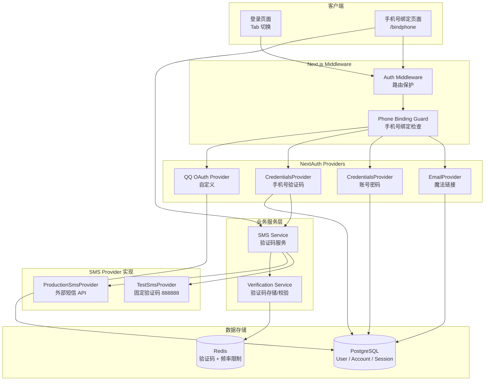
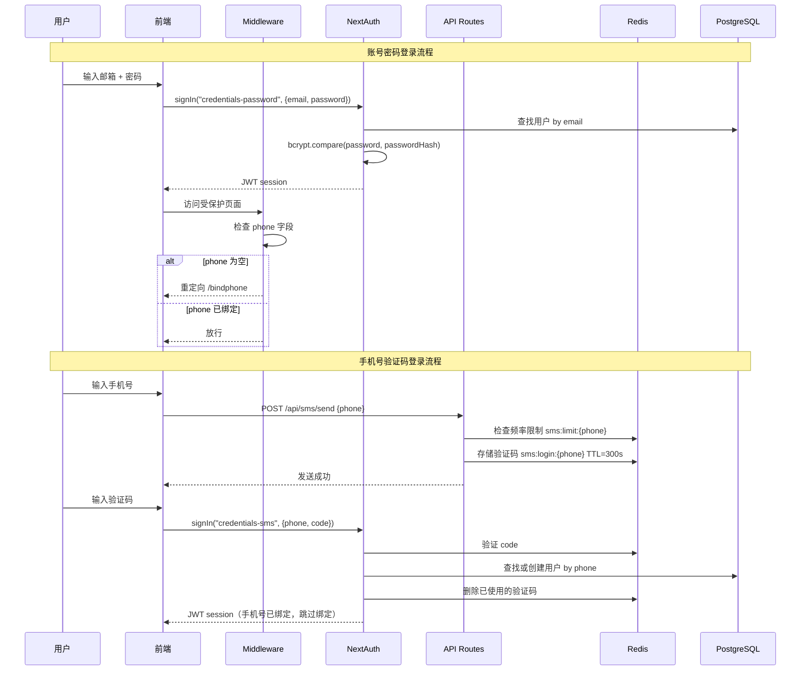

# 设计文档：多方式登录

## 概述

本设计为学生社区平台扩展认证系统，在现有邮箱魔法链接登录基础上新增三种登录方式：账号密码登录、手机号验证码登录、QQ 授权登录。核心设计决策包括：

1. **会话策略切换**：现有系统使用 NextAuth v4 的 `database` session strategy，但 `CredentialsProvider` 不支持 database session。需要将整体会话策略切换为 `jwt`，同时保持现有 EmailProvider 功能不变。
2. **QQ OAuth 自定义 Provider**：NextAuth 没有内置 QQ provider，需要基于 OAuth 2.0 协议自定义实现。
3. **验证码服务**：采用 Provider 模式，通过 `SmsProvider` 接口抽象短信发送，支持测试模式和生产模式切换。
4. **手机号绑定守卫**：通过 Next.js middleware 实现登录后强制绑定手机号的拦截逻辑。

### 关键技术约束

- NextAuth v4 的 CredentialsProvider + database session 不兼容，必须使用 JWT strategy
- JWT strategy 下 session callback 接收 `token` 而非 `user`，需要调整回调逻辑
- 现有 EmailProvider 在 JWT strategy 下仍可正常工作
- QQ OAuth 2.0 使用非标准的 token 响应格式（`callback` 格式而非 JSON），需要自定义 token 解析

## 架构

### 整体架构图



### 认证流程时序图



## 组件与接口

### 1. NextAuth 配置扩展 (`src/lib/auth.ts`)

现有配置需要做以下修改：

- **会话策略**：从 `database` 切换为 `jwt`
- **新增 Providers**：
  - `CredentialsProvider`（id: `"credentials-password"`）用于账号密码登录
  - `CredentialsProvider`（id: `"credentials-sms"`）用于手机号验证码登录
  - 自定义 QQ OAuth Provider
- **回调调整**：`jwt` callback 注入用户信息，`session` callback 从 token 读取

```typescript
// src/lib/auth.ts 关键变更
export const authOptions: NextAuthOptions = {
  // ...保留 adapter 和 EmailProvider
  session: { strategy: "jwt" },
  providers: [
    EmailProvider({ /* 保持不变 */ }),
    CredentialsProvider({
      id: "credentials-password",
      credentials: { email: {}, password: {} },
      async authorize(credentials) { /* 密码验证逻辑 */ }
    }),
    CredentialsProvider({
      id: "credentials-sms",
      credentials: { phone: {}, code: {} },
      async authorize(credentials) { /* 验证码验证逻辑 */ }
    }),
    QQProvider({ clientId: env.QQ_APP_ID, clientSecret: env.QQ_APP_SECRET }),
  ],
  callbacks: {
    async jwt({ token, user, account }) { /* 注入 id, role, phone */ },
    async session({ session, token }) { /* 从 token 读取用户信息 */ },
  },
};
```

### 2. QQ OAuth Provider (`src/lib/auth/qq-provider.ts`)

自定义 NextAuth OAuth Provider，处理 QQ OAuth 2.0 的非标准响应格式。

```typescript
interface QQProfile {
  openid: string;
  nickname: string;
  figureurl_qq_2: string; // 头像 URL
}

// QQ OAuth 端点：
// 授权: https://graph.qq.com/oauth2.0/authorize
// Token: https://graph.qq.com/oauth2.0/token
// OpenID: https://graph.qq.com/oauth2.0/me
// 用户信息: https://graph.qq.com/user/get_user_info
```

### 3. SMS 服务 (`src/lib/sms/`)

```typescript
// src/lib/sms/types.ts
export interface SmsProvider {
  sendCode(phone: string, code: string): Promise<boolean>;
}

// src/lib/sms/test-provider.ts
export class TestSmsProvider implements SmsProvider {
  async sendCode(phone: string, code: string): Promise<boolean> {
    console.log(`[TEST SMS] ${phone}: ${code}`);
    return true;
  }
}

// src/lib/sms/production-provider.ts
export class ProductionSmsProvider implements SmsProvider {
  async sendCode(phone: string, code: string): Promise<boolean> {
    // 调用外部短信 API
  }
}

// src/lib/sms/index.ts
export function getSmsProvider(): SmsProvider {
  if (process.env.SMS_TEST_MODE === "true") {
    return new TestSmsProvider();
  }
  return new ProductionSmsProvider();
}
```

### 4. 验证码服务 (`src/lib/sms/verification.ts`)

```typescript
export async function generateCode(): Promise<string>;  // 6位安全随机数
export async function sendVerificationCode(phone: string): Promise<{ success: boolean; error?: string }>;
export async function verifyCode(phone: string, code: string): Promise<boolean>;
```

- 验证码存储在 Redis，key: `sms:login:{phone}`，TTL: 300s
- 频率限制 key: `sms:limit:{phone}`，60s 内仅允许 1 次
- 测试模式下固定验证码 `"888888"`，跳过真实发送
- 验证成功后立即删除 Redis 中的验证码

### 5. 手机号绑定 API (`src/app/api/sms/send/route.ts`)

```typescript
// POST /api/sms/send
// Body: { phone: string, purpose: "login" | "bindphone" }
// Response: { success: boolean } | { error: string }
```

### 6. 手机号绑定 API (`src/app/api/auth/bindphone/route.ts`)

```typescript
// POST /api/auth/bindphone
// Body: { phone: string, code: string }
// Response: { success: boolean } | { error: string }
// 需要已登录状态（从 JWT token 获取 userId）
```

### 7. 密码设置 API (`src/app/api/auth/password/route.ts`)

```typescript
// POST /api/auth/password
// Body: { password: string }
// Response: { success: boolean } | { error: string }
// 仅允许 passwordHash 为空的用户设置密码
```

### 8. Phone Binding Guard（中间件扩展）

扩展现有 `src/middleware.ts`，在认证检查后增加手机号绑定检查：

```typescript
// 白名单路径（不触发绑定重定向）：
const BINDPHONE_WHITELIST = [
  "/api/auth",
  "/api/sms",
  "/bindphone",
  "/logout",
  "/login",
];

// 逻辑：
// 1. 获取 JWT token
// 2. 如果 token.phone 为空且路径不在白名单中
// 3. 重定向至 /bindphone
```

### 9. 登录页面重构 (`src/app/(auth)/login/page.tsx`)

将现有登录页面重构为 Tab 切换模式：

- Tab 1: 邮箱登录（保留现有魔法链接逻辑）
- Tab 2: 账号密码登录
- Tab 3: 手机号登录
- 分隔线下方: QQ 登录按钮
- 保留邀请码注册入口

### 10. 手机号绑定页面 (`src/app/(auth)/bindphone/page.tsx`)

独立页面，包含手机号输入、验证码输入、发送验证码按钮。

## 数据模型

### User 模型扩展

```prisma
model User {
  // ... 现有字段保持不变
  phone         String?   @unique  // 新增：手机号
  passwordHash  String?             // 新增：bcrypt 哈希密码
}
```

### Redis 数据结构

| Key 格式 | 值 | TTL | 用途 |
|---|---|---|---|
| `sms:login:{phone}` | 6 位验证码字符串 | 300s | 登录验证码 |
| `sms:bind:{phone}` | 6 位验证码字符串 | 300s | 绑定手机号验证码 |
| `sms:limit:{phone}` | `"1"` | 60s | 发送频率限制 |

### NextAuth JWT Token 扩展

```typescript
// 扩展 JWT token 类型
interface ExtendedJWT extends JWT {
  id: string;
  role: string;
  phone: string | null;
}
```

### 新增 Zod 验证 Schema

```typescript
// src/lib/validators.ts 新增
export const phoneSchema = z
  .string()
  .regex(/^1\d{10}$/, "请输入有效的中国大陆手机号");

export const verificationCodeSchema = z
  .string()
  .regex(/^\d{6}$/, "验证码为 6 位数字");

export const passwordSchema = z
  .string()
  .min(8, "密码至少 8 个字符")
  .max(72, "密码不能超过 72 个字符");

export const loginPasswordSchema = z.object({
  email: emailSchema,
  password: z.string().min(1, "请输入密码"),
});

export const loginSmsSchema = z.object({
  phone: phoneSchema,
  code: verificationCodeSchema,
});

export const sendCodeSchema = z.object({
  phone: phoneSchema,
  purpose: z.enum(["login", "bindphone"]),
});

export const bindPhoneSchema = z.object({
  phone: phoneSchema,
  code: verificationCodeSchema,
});

export const setPasswordSchema = z.object({
  password: passwordSchema,
});
```


## 正确性属性

*属性（Property）是一种在系统所有有效执行中都应成立的特征或行为——本质上是关于系统应该做什么的形式化陈述。属性是人类可读规范与机器可验证正确性保证之间的桥梁。*

### Property 1: 密码哈希 Round-Trip

*For any* 有效密码字符串（8-72 字符），使用 bcrypt（cost factor ≥ 10）哈希后，用原始密码调用 bcrypt.compare 应返回 true，且哈希结果应匹配 bcrypt 格式（以 `$2b$` 开头，cost factor ≥ 10）。

**Validates: Requirements 1.2, 1.5**

### Property 2: 无效登录输入拒绝

*For any* 无效邮箱格式字符串或空密码字符串，登录表单验证器（loginPasswordSchema）应拒绝该输入并返回验证错误。

**Validates: Requirements 1.3**

### Property 3: 统一错误提示不泄露信息

*For any* 不存在的邮箱或错误的密码，密码登录 authorize 函数返回的错误消息应始终为 "邮箱或密码错误"，不区分是邮箱不存在还是密码错误。

**Validates: Requirements 1.4**

### Property 4: 验证码格式

*For any* 调用 generateCode() 生成的验证码，结果应为恰好 6 位的纯数字字符串（匹配 `/^\d{6}$/`）。

**Validates: Requirements 2.2, 6.7**

### Property 5: 验证码存储与验证 Round-Trip

*For any* 有效手机号，调用 sendVerificationCode 存储验证码后，使用同一手机号和正确验证码调用 verifyCode 应返回 true。

**Validates: Requirements 2.4, 2.7**

### Property 6: 错误验证码拒绝

*For any* 有效手机号和已存储的验证码，使用与存储值不同的任意 6 位数字字符串调用 verifyCode 应返回 false。

**Validates: Requirements 2.5**

### Property 7: 测试模式固定验证码

*For any* 有效手机号，当 SMS_TEST_MODE=true 时，sendVerificationCode 存储的验证码应固定为 "888888"。

**Validates: Requirements 2.8**

### Property 8: SMS Provider 环境选择

*For any* 环境变量配置，当 SMS_TEST_MODE=true 时 getSmsProvider() 应返回 TestSmsProvider 实例；当 SMS_TEST_MODE 未设置或为 false 时应返回 ProductionSmsProvider 实例。

**Validates: Requirements 6.3, 6.4**

### Property 9: 验证码发送频率限制

*For any* 有效手机号，在 60 秒内第一次调用 sendVerificationCode 应成功，第二次调用应返回频率限制错误。

**Validates: Requirements 6.5**

### Property 10: 手机号绑定守卫路由规则

*For any* 已登录但 phone 为空的用户，访问白名单路径（/api/auth、/api/sms、/bindphone、/logout、/login）不应被重定向；访问任意其他受保护路径应被重定向至 /bindphone。

**Validates: Requirements 5.1, 5.6, 5.7**

### Property 11: 手机号登录隐含已绑定

*For any* 通过手机号验证码登录的用户，其 JWT token 中的 phone 字段应等于登录时使用的手机号，从而跳过强制绑定流程。

**Validates: Requirements 5.8**

### Property 12: 手机号唯一性约束

*For any* 已被用户 A 绑定的手机号，当用户 B 尝试绑定同一手机号时，绑定操作应失败并返回错误。

**Validates: Requirements 5.5**

### Property 13: 标签页切换清空表单状态

*For any* 登录页面状态，当用户从一个标签页切换到另一个标签页时，前一个标签页的所有表单输入值和错误提示应被清空。

**Validates: Requirements 7.4**

### Property 14: 手机号绑定 Round-Trip

*For any* 已登录用户和有效手机号，完成验证码验证并绑定后，查询该用户的 phone 字段应等于绑定时提交的手机号。

**Validates: Requirements 5.4**

## 错误处理

### 认证错误

| 场景 | HTTP 状态码 | 错误消息 | 处理方式 |
|---|---|---|---|
| 邮箱或密码错误 | 401 | "邮箱或密码错误" | 统一提示，不泄露具体字段 |
| 验证码错误或过期 | 401 | "验证码错误或已过期" | 提示用户重新获取 |
| QQ 授权失败 | - | "QQ 授权失败，请重试" | 重定向回登录页 |
| 手机号已被绑定 | 409 | "该手机号已被其他账户绑定" | 提示用户使用其他手机号 |
| 验证码发送过于频繁 | 429 | "请求过于频繁，请稍后再试" | 显示剩余等待时间 |

### 输入验证错误

| 场景 | 处理方式 |
|---|---|
| 无效邮箱格式 | 客户端 Zod 验证，显示字段级错误 |
| 无效手机号格式 | 客户端 Zod 验证，显示字段级错误 |
| 空密码 | 客户端 Zod 验证，显示字段级错误 |
| 无效验证码格式 | 客户端 Zod 验证，显示字段级错误 |

### 系统错误

| 场景 | 处理方式 |
|---|---|
| Redis 连接失败 | 返回 500，日志记录，提示用户稍后重试 |
| 短信服务商 API 失败 | 返回 500，日志记录，提示用户稍后重试 |
| QQ OAuth API 不可用 | 重定向回登录页，显示错误提示 |
| 数据库操作失败 | 返回 500，日志记录 |

## 测试策略

### 测试框架

- 单元测试和属性测试：**vitest** + **fast-check**
- 属性测试每个 property 至少运行 **100 次迭代**
- 每个属性测试必须用注释标注对应的设计文档 property
- 标注格式：`// Feature: multi-auth-login, Property {number}: {property_text}`

### 单元测试覆盖

1. **密码登录 authorize 函数**：正确密码、错误密码、不存在的邮箱、空输入
2. **手机号登录 authorize 函数**：正确验证码、错误验证码、过期验证码、不存在的手机号
3. **QQ Provider 配置**：端点 URL、profile 解析、错误处理
4. **验证码服务**：生成、存储、验证、过期、频率限制
5. **SMS Provider 选择**：测试模式 vs 生产模式
6. **手机号绑定 API**：成功绑定、手机号已被占用、未登录
7. **密码设置 API**：成功设置、已有密码时拒绝
8. **Phone Binding Guard**：白名单路径放行、非白名单路径重定向、已绑定用户放行
9. **Zod 验证 Schema**：各种有效和无效输入
10. **登录页面组件**：Tab 切换、表单提交、错误显示

### 属性测试覆盖

每个正确性属性（Property 1-14）对应一个属性测试，使用 fast-check 生成随机输入：

- **Property 1**：`fc.string()` 生成随机密码，验证 bcrypt round-trip
- **Property 2**：`fc.string()` 生成随机字符串，验证无效输入被拒绝
- **Property 3**：`fc.string()` 生成随机邮箱和密码，验证错误消息一致性
- **Property 4**：多次调用 generateCode()，验证格式
- **Property 5**：`fc.string()` 生成随机手机号，验证验证码 round-trip
- **Property 6**：生成随机手机号和不匹配的验证码，验证拒绝
- **Property 7**：生成随机手机号，验证测试模式下固定验证码
- **Property 8**：验证环境变量到 provider 类型的映射
- **Property 9**：生成随机手机号，验证频率限制
- **Property 10**：生成随机路径，验证 guard 路由规则
- **Property 11**：生成随机手机号，验证登录后 token 包含 phone
- **Property 12**：生成两个随机用户和一个手机号，验证唯一性
- **Property 13**：生成随机表单状态，验证切换后清空
- **Property 14**：生成随机用户和手机号，验证绑定 round-trip

### 测试文件组织

```
src/lib/sms/__tests__/
  verification.test.ts          # 验证码服务单元测试
  verification.property.test.ts # 验证码服务属性测试 (P4, P5, P6, P7, P9)
  provider.test.ts              # SMS Provider 选择测试 (P8)

src/lib/__tests__/
  auth.test.ts                  # 扩展现有测试，增加新 provider 测试
  auth.property.test.ts         # 认证属性测试 (P1, P2, P3)
  phone-binding-guard.test.ts   # 绑定守卫单元测试
  phone-binding-guard.property.test.ts # 绑定守卫属性测试 (P10)

src/app/api/auth/bindphone/__tests__/
  route.test.ts                 # 绑定 API 单元测试 (P12, P14)

src/app/(auth)/login/__tests__/
  login-page.test.ts            # 登录页面组件测试 (P13)

src/app/(auth)/bindphone/__tests__/
  bindphone-page.test.ts        # 绑定页面组件测试
```
