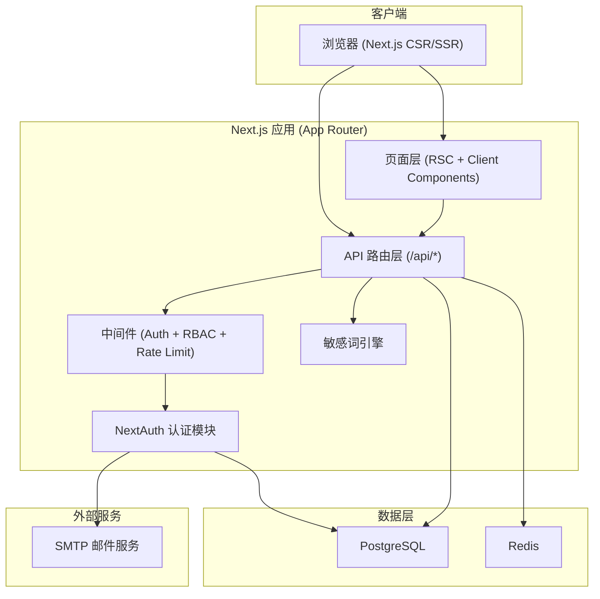
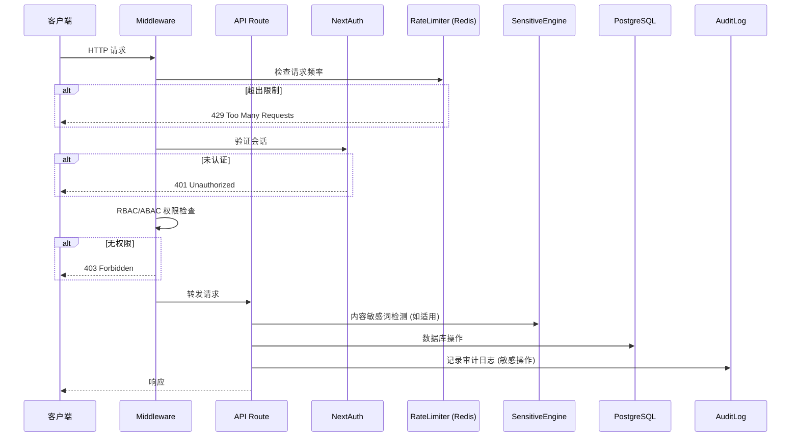
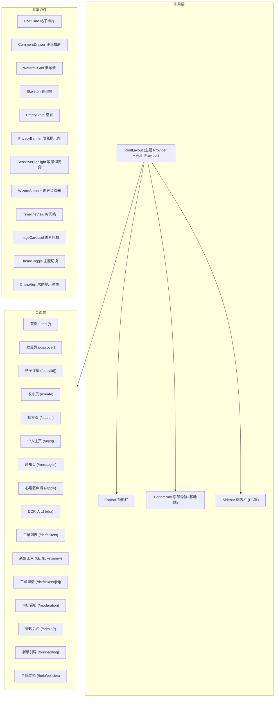
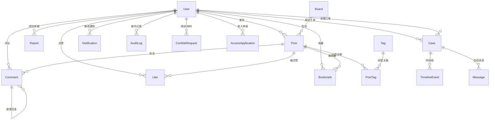

# 设计文档：学生交流社区平台

## 概述

学生交流社区平台是一个面向学生群体的多层级社区系统，采用 Next.js 14/15 App Router + TypeScript + Tailwind CSS + shadcn/ui 构建前端，PostgreSQL + Prisma 作为数据层，Redis 用于缓存、限流和队列，NextAuth 实现邮箱魔法链接认证。平台包含三个核心区域：

1. **公开区** — 娱乐与技术科普，无需审核即可发帖
2. **半私密心理交流区** — 匿名同伴倾听与情绪支持，需准入审核
3. **私密 DCR 区** — 权益信息互助与合规工单流转，白名单准入 + 先审后发

平台以"合规化、多元化、稳定化"为硬约束，严格遵循最小化数据原则。

### 设计目标

- 移动端优先的响应式体验，小红书风格瀑布流 Feed
- RBAC + ABAC 双重权限控制，精细化访问管理
- 敏感词引擎 + 脱敏机制，保障用户隐私
- Docker Compose 一键部署，开发体验友好
- 审计日志不可篡改，满足合规要求

## 架构

### 系统架构图



### 请求处理流程



### 技术栈决策

| 层级 | 技术选型 | 决策理由 |
|------|---------|---------|
| 前端框架 | Next.js 14/15 App Router | SSR/RSC 支持、文件系统路由、API Routes 一体化 |
| UI 组件 | shadcn/ui + Tailwind CSS | 可定制、无运行时开销、暗色模式原生支持 |
| 数据库 | PostgreSQL + Prisma | 关系型数据完整性、类型安全 ORM、迁移管理 |
| 缓存/队列 | Redis | 限流计数器、会话缓存、审核队列、倾听匹配队列 |
| 认证 | NextAuth.js | 邮箱魔法链接、会话管理、中间件集成 |
| 部署 | Docker Compose | 一键启动、环境一致性、开发友好 |


## 组件与接口

### 前端组件架构



### 后端模块划分

```
src/
├── app/                          # Next.js App Router
│   ├── (public)/                 # 公开页面组
│   │   ├── page.tsx              # 首页 Feed
│   │   ├── discover/page.tsx     # 发现页
│   │   ├── search/page.tsx       # 搜索页
│   │   └── post/[id]/page.tsx    # 帖子详情
│   ├── (auth)/                   # 认证页面组
│   │   ├── login/page.tsx        # 登录页
│   │   └── onboarding/page.tsx   # 新手引导
│   ├── (member)/                 # 会员页面组
│   │   ├── create/page.tsx       # 发布页
│   │   ├── messages/page.tsx     # 通知页
│   │   ├── u/[id]/page.tsx       # 个人主页
│   │   └── settings/profile/page.tsx
│   ├── (psych)/                  # 心理区页面组
│   │   └── apply/page.tsx        # 心理区申请
│   ├── (dcr)/                    # DCR 区页面组
│   │   ├── dcr/page.tsx          # DCR 入口
│   │   └── dcr/tickets/          # 工单页面
│   ├── (admin)/                  # 管理后台页面组
│   │   ├── admin/                # Admin 页面
│   │   └── moderation/page.tsx   # 审核看板
│   ├── api/                      # API 路由
│   │   ├── auth/[...nextauth]/   # NextAuth
│   │   ├── posts/                # 帖子 CRUD
│   │   ├── comments/             # 评论 CRUD
│   │   ├── reports/              # 举报
│   │   ├── cases/                # 工单
│   │   ├── moderation/           # 审核
│   │   ├── notifications/        # 通知
│   │   ├── users/                # 用户管理
│   │   ├── boards/               # 板块管理
│   │   ├── tags/                 # 标签管理
│   │   ├── kb/                   # 知识库
│   │   ├── invites/              # 邀请码
│   │   └── admin/                # 管理接口
│   └── help/policies/page.tsx    # 合规文档
├── lib/                          # 核心库
│   ├── auth.ts                   # NextAuth 配置
│   ├── prisma.ts                 # Prisma 客户端
│   ├── redis.ts                  # Redis 客户端
│   ├── rbac.ts                   # RBAC 权限定义
│   ├── abac.ts                   # ABAC 属性策略
│   ├── sensitive-engine.ts       # 敏感词引擎
│   ├── rate-limiter.ts           # 限流器
│   ├── audit.ts                  # 审计日志工具
│   └── validators.ts             # 输入验证 (zod)
├── components/                   # UI 组件
│   ├── layout/                   # 布局组件
│   ├── feed/                     # Feed 相关
│   ├── post/                     # 帖子相关
│   ├── comment/                  # 评论相关
│   ├── dcr/                      # DCR 相关
│   ├── psych/                    # 心理区相关
│   ├── admin/                    # 管理后台
│   └── shared/                   # 共享组件
└── prisma/
    └── schema.prisma             # 数据库 Schema
```

### API 接口设计

#### 认证接口

| 方法 | 路径 | 描述 | 权限 |
|------|------|------|------|
| POST | `/api/auth/signin/email` | 发送魔法链接 | 公开 |
| GET | `/api/auth/callback/email` | 验证魔法链接 | 公开 |
| POST | `/api/auth/invite` | 邀请码注册 | 公开 |

#### 帖子接口

| 方法 | 路径 | 描述 | 权限 |
|------|------|------|------|
| GET | `/api/posts` | 获取帖子列表（分页、筛选） | User+ |
| GET | `/api/posts/[id]` | 获取帖子详情 | User+ (板块权限) |
| POST | `/api/posts` | 创建帖子 | User+ (板块权限 + ABAC) |
| PATCH | `/api/posts/[id]` | 编辑帖子 | 作者 |
| DELETE | `/api/posts/[id]` | 软删除帖子 | 作者 / Moderator+ |
| POST | `/api/posts/[id]/like` | 点赞/取消点赞 | User+ |
| POST | `/api/posts/[id]/bookmark` | 收藏/取消收藏 | User+ |

#### 评论接口

| 方法 | 路径 | 描述 | 权限 |
|------|------|------|------|
| GET | `/api/posts/[id]/comments` | 获取帖子评论列表 | User+ |
| POST | `/api/posts/[id]/comments` | 创建评论 | User+ |
| PATCH | `/api/comments/[id]` | 编辑评论 | 作者 |
| DELETE | `/api/comments/[id]` | 软删除评论 | 作者 / Moderator+ |

#### 举报接口

| 方法 | 路径 | 描述 | 权限 |
|------|------|------|------|
| POST | `/api/reports` | 提交举报 | User+ |
| GET | `/api/reports` | 获取举报列表 | Moderator+ |
| PATCH | `/api/reports/[id]` | 更新举报状态 | Moderator+ |

#### DCR 工单接口

| 方法 | 路径 | 描述 | 权限 |
|------|------|------|------|
| POST | `/api/cases` | 创建工单（Wizard 提交） | DCR 准入用户 |
| GET | `/api/cases` | 获取工单列表 | DCR 准入用户 |
| GET | `/api/cases/[id]` | 获取工单详情 | 工单相关方 |
| PATCH | `/api/cases/[id]` | 更新工单状态 | DCRHelper / Admin |
| GET | `/api/cases/[id]/export` | 导出工单 CSV | Admin |
| GET | `/api/cases/[id]/timeline` | 获取工单时间线 | 工单相关方 |

#### 审核接口

| 方法 | 路径 | 描述 | 权限 |
|------|------|------|------|
| GET | `/api/moderation/queue` | 获取审核队列 | Moderator+ |
| POST | `/api/moderation/[id]/approve` | 批准内容 | Moderator+ |
| POST | `/api/moderation/[id]/reject` | 拒绝内容 | Moderator+ |

#### 通知接口

| 方法 | 路径 | 描述 | 权限 |
|------|------|------|------|
| GET | `/api/notifications` | 获取通知列表 | User+ |
| PATCH | `/api/notifications/[id]/read` | 标记已读 | User+ |
| POST | `/api/notifications/read-all` | 全部标记已读 | User+ |

#### 用户与管理接口

| 方法 | 路径 | 描述 | 权限 |
|------|------|------|------|
| GET | `/api/users/[id]` | 获取用户资料 | User+ |
| PATCH | `/api/users/[id]` | 更新用户资料 | 本人 |
| GET | `/api/admin/users` | 管理用户列表 | Admin |
| PATCH | `/api/admin/users/[id]/role` | 变更用户角色 | Admin |
| POST | `/api/admin/users/[id]/ban` | 封禁/解封用户 | Admin |
| GET | `/api/admin/audit` | 审计日志查询 | Admin |
| POST | `/api/admin/invites` | 生成邀请码 | Admin |
| GET | `/api/admin/invites` | 邀请码列表 | Admin |
| DELETE | `/api/admin/invites/[id]` | 撤销邀请码 | Admin |

#### 板块与标签接口

| 方法 | 路径 | 描述 | 权限 |
|------|------|------|------|
| GET | `/api/boards` | 获取板块列表（按权限过滤） | User+ |
| POST | `/api/boards` | 创建板块 | Admin |
| PATCH | `/api/boards/[id]` | 编辑板块 | Admin |
| GET | `/api/tags` | 获取标签列表 | User+ |
| POST | `/api/tags` | 创建标签 | Moderator+ |

#### 知识库接口

| 方法 | 路径 | 描述 | 权限 |
|------|------|------|------|
| GET | `/api/kb` | 获取文章列表 | User+ (按权限过滤) |
| GET | `/api/kb/[id]` | 获取文章详情 | User+ (按权限过滤) |
| POST | `/api/kb` | 创建文章 | Admin |
| PATCH | `/api/kb/[id]` | 编辑文章 | Admin |
| GET | `/api/kb/search` | 搜索知识库 | User+ |

#### 心理区接口

| 方法 | 路径 | 描述 | 权限 |
|------|------|------|------|
| POST | `/api/psych/apply` | 申请心理区准入 | User+ |
| POST | `/api/psych/confide` | 提交倾诉请求 | 心理区准入用户 |
| GET | `/api/psych/queue` | 获取倾诉匹配队列 | Listener |
| POST | `/api/psych/match/[id]` | 领取倾诉请求 | Listener |
| POST | `/api/psych/session/[id]/close` | 结束倾听会话 | 会话参与方 |

#### DCR 准入接口

| 方法 | 路径 | 描述 | 权限 |
|------|------|------|------|
| POST | `/api/dcr/apply` | 申请 DCR 准入 | TrustedUser+ |
| PATCH | `/api/dcr/apply/[id]` | 审核 DCR 准入 | Admin |


## 数据模型

### Prisma Schema

```prisma
// prisma/schema.prisma

generator client {
  provider = "prisma-client-js"
}

datasource db {
  provider = "postgresql"
  url      = env("DATABASE_URL")
}

// ==================== 用户与认证 ====================

enum Role {
  USER
  TRUSTED_USER
  MODERATOR
  ADMIN
  DCR_HELPER
}

model User {
  id            String    @id @default(cuid())
  email         String?   @unique
  nickname      String?
  avatar        String?
  bio           String?
  role          Role      @default(USER)
  isBanned      Boolean   @default(false)
  isShadowBanned Boolean  @default(false)
  isAnonymous   Boolean   @default(false)
  reputationScore Int     @default(100)
  violationCount  Int     @default(0)
  onboardingDone  Boolean @default(false)
  psychAccess     Boolean @default(false)
  dcrAccess       Boolean @default(false)
  dcrPledgeSigned Boolean @default(false)
  quizPassed      Boolean @default(false)
  createdAt     DateTime  @default(now())
  updatedAt     DateTime  @updatedAt

  // NextAuth 关联
  accounts      Account[]
  sessions      Session[]

  // 内容关联
  posts         Post[]
  comments      Comment[]
  likes         Like[]
  bookmarks     Bookmark[]

  // 举报
  reportsFiled    Report[]  @relation("ReportFiler")
  reportsReceived Report[]  @relation("ReportTarget")

  // DCR
  casesSubmitted  Case[]    @relation("CaseSubmitter")
  casesHandled    Case[]    @relation("CaseHandler")

  // 心理区
  confideRequests ConfideRequest[] @relation("ConfideRequester")
  listeningTaken  ConfideRequest[] @relation("ConfideListener")

  // 通知
  notifications   Notification[]

  // 审计
  auditLogs       AuditLog[]

  // 消息
  messagesSent    Message[] @relation("MessageSender")
  messagesReceived Message[] @relation("MessageReceiver")

  // 邀请码
  inviteCode      InviteCode? @relation("InviteUsedBy")
  invitesCreated  InviteCode[] @relation("InviteCreator")

  // 准入申请
  accessApplications AccessApplication[]
}

// NextAuth 模型
model Account {
  id                String  @id @default(cuid())
  userId            String
  type              String
  provider          String
  providerAccountId String
  refresh_token     String?
  access_token      String?
  expires_at        Int?
  token_type        String?
  scope             String?
  id_token          String?
  session_state     String?

  user User @relation(fields: [userId], references: [id], onDelete: Cascade)

  @@unique([provider, providerAccountId])
}

model Session {
  id           String   @id @default(cuid())
  sessionToken String   @unique
  userId       String
  expires      DateTime

  user User @relation(fields: [userId], references: [id], onDelete: Cascade)
}

model VerificationToken {
  identifier String
  token      String   @unique
  expires    DateTime

  @@unique([identifier, token])
}

// ==================== 板块与标签 ====================

enum BoardZone {
  PUBLIC       // 公开区
  PSYCHOLOGY   // 半私密心理区
  DCR          // 私密 DCR 区
}

model Board {
  id          String    @id @default(cuid())
  name        String
  description String?
  zone        BoardZone
  sortWeight  Int       @default(0)
  isActive    Boolean   @default(true)
  createdAt   DateTime  @default(now())
  updatedAt   DateTime  @updatedAt

  posts       Post[]
}

model Tag {
  id        String   @id @default(cuid())
  name      String   @unique
  createdAt DateTime @default(now())

  posts     PostTag[]
}

model PostTag {
  postId String
  tagId  String

  post Post @relation(fields: [postId], references: [id], onDelete: Cascade)
  tag  Tag  @relation(fields: [tagId], references: [id], onDelete: Cascade)

  @@id([postId, tagId])
}

// ==================== 帖子与评论 ====================

enum PostStatus {
  DRAFT
  PENDING      // 待审核
  PUBLISHED
  REJECTED
  DELETED      // 软删除
}

enum PostVisibility {
  PUBLIC       // 公开
  MATCHED      // 仅匹配方可见
  MODS_ONLY    // 仅版主可见
}

enum DCRCategory {
  TUTORING     // 补课
  FEES         // 收费
  WEEKENDS     // 双休
  OTHER        // 其他
}

model Post {
  id          String         @id @default(cuid())
  title       String
  content     String
  summary     String?
  images      String[]       // 图片 URL 数组
  status      PostStatus     @default(PUBLISHED)
  visibility  PostVisibility @default(PUBLIC)
  isAnonymous Boolean        @default(false)
  anonymousId String?        // 匿名标识
  dcrCategory DCRCategory?
  likeCount   Int            @default(0)
  commentCount Int           @default(0)
  createdAt   DateTime       @default(now())
  updatedAt   DateTime       @updatedAt

  authorId    String
  boardId     String

  author      User           @relation(fields: [authorId], references: [id])
  board       Board          @relation(fields: [boardId], references: [id])
  tags        PostTag[]
  comments    Comment[]
  likes       Like[]
  bookmarks   Bookmark[]
  reports     Report[]       @relation("ReportedPost")
  editHistory PostEditHistory[]
}

model PostEditHistory {
  id        String   @id @default(cuid())
  postId    String
  oldTitle  String?
  oldContent String?
  editedAt  DateTime @default(now())

  post Post @relation(fields: [postId], references: [id], onDelete: Cascade)
}

model Comment {
  id          String   @id @default(cuid())
  content     String
  isDeleted   Boolean  @default(false)
  isAnonymous Boolean  @default(false)
  anonymousId String?
  createdAt   DateTime @default(now())
  updatedAt   DateTime @updatedAt

  authorId    String
  postId      String
  parentId    String?  // 嵌套回复

  author      User     @relation(fields: [authorId], references: [id])
  post        Post     @relation(fields: [postId], references: [id], onDelete: Cascade)
  parent      Comment? @relation("CommentReplies", fields: [parentId], references: [id])
  replies     Comment[] @relation("CommentReplies")
  reports     Report[] @relation("ReportedComment")
}

model Like {
  userId    String
  postId    String
  createdAt DateTime @default(now())

  user User @relation(fields: [userId], references: [id], onDelete: Cascade)
  post Post @relation(fields: [postId], references: [id], onDelete: Cascade)

  @@id([userId, postId])
}

model Bookmark {
  userId    String
  postId    String
  createdAt DateTime @default(now())

  user User @relation(fields: [userId], references: [id], onDelete: Cascade)
  post Post @relation(fields: [postId], references: [id], onDelete: Cascade)

  @@id([userId, postId])
}

// ==================== 举报 ====================

enum ReportStatus {
  PENDING      // 待处理
  IN_PROGRESS  // 处理中
  RESOLVED     // 已处理
  DISMISSED    // 驳回
}

model Report {
  id          String       @id @default(cuid())
  reason      String
  details     String?
  status      ReportStatus @default(PENDING)
  resolution  String?
  createdAt   DateTime     @default(now())
  updatedAt   DateTime     @updatedAt

  reporterId  String
  targetUserId String?
  targetPostId String?
  targetCommentId String?

  reporter    User     @relation("ReportFiler", fields: [reporterId], references: [id])
  targetUser  User?    @relation("ReportTarget", fields: [targetUserId], references: [id])
  targetPost  Post?    @relation("ReportedPost", fields: [targetPostId], references: [id])
  targetComment Comment? @relation("ReportedComment", fields: [targetCommentId], references: [id])
}

// ==================== DCR 工单 ====================

enum CaseStatus {
  OPENED
  IN_PROGRESS
  NEED_MORE_INFO
  CLOSED
}

model Case {
  id            String     @id @default(cuid())
  category      DCRCategory
  formData      Json       // 委托表结构化数据
  status        CaseStatus @default(OPENED)
  pledgeText    String     // 强制声明内容
  createdAt     DateTime   @default(now())
  updatedAt     DateTime   @updatedAt

  submitterId   String
  handlerId     String?

  submitter     User       @relation("CaseSubmitter", fields: [submitterId], references: [id])
  handler       User?      @relation("CaseHandler", fields: [handlerId], references: [id])
  timeline      TimelineEvent[]
  messages      Message[]
}

model TimelineEvent {
  id          String   @id @default(cuid())
  action      String   // 状态变更描述
  oldStatus   String?
  newStatus   String?
  details     String?
  createdAt   DateTime @default(now())

  caseId      String
  case_       Case     @relation(fields: [caseId], references: [id], onDelete: Cascade)
}

// ==================== 消息 ====================

model Message {
  id          String   @id @default(cuid())
  content     String
  isAnonymous Boolean  @default(false)
  createdAt   DateTime @default(now())

  senderId    String
  receiverId  String
  caseId      String?
  sessionId   String?  // 倾听会话 ID

  sender      User     @relation("MessageSender", fields: [senderId], references: [id])
  receiver    User     @relation("MessageReceiver", fields: [receiverId], references: [id])
  case_       Case?    @relation(fields: [caseId], references: [id])
}

// ==================== 心理区 ====================

enum ConfideStatus {
  WAITING     // 等待匹配
  MATCHED     // 已匹配
  ACTIVE      // 会话进行中
  CLOSED      // 已关闭
}

model ConfideRequest {
  id          String        @id @default(cuid())
  summary     String        // 倾诉摘要
  anonymousId String        // 匿名标识
  status      ConfideStatus @default(WAITING)
  expiresAt   DateTime      // 30 天后自动清理
  createdAt   DateTime      @default(now())
  closedAt    DateTime?

  requesterId String
  listenerId  String?

  requester   User          @relation("ConfideRequester", fields: [requesterId], references: [id])
  listener    User?         @relation("ConfideListener", fields: [listenerId], references: [id])
}

// ==================== 通知 ====================

enum NotificationType {
  COMMENT       // 评论通知
  LIKE          // 点赞通知
  REPORT_RESULT // 举报结果
  CASE_UPDATE   // 工单状态变更
  DCR_ACCESS    // DCR 准入结果
  PSYCH_MATCH   // 倾诉匹配
  SYSTEM        // 系统通知
}

model Notification {
  id        String           @id @default(cuid())
  type      NotificationType
  title     String
  content   String
  isRead    Boolean          @default(false)
  link      String?          // 跳转链接
  createdAt DateTime         @default(now())

  userId    String
  user      User             @relation(fields: [userId], references: [id], onDelete: Cascade)
}

// ==================== 审计日志 ====================

model AuditLog {
  id          String   @id @default(cuid())
  action      String   // 操作类型
  targetType  String   // 目标对象类型
  targetId    String   // 目标对象 ID
  details     Json?    // 操作详情
  ipHash      String?  // IP 哈希
  createdAt   DateTime @default(now())

  operatorId  String
  operator    User     @relation(fields: [operatorId], references: [id])

  @@index([createdAt])
  @@index([action])
  @@index([operatorId])
}

// ==================== 邀请码 ====================

model InviteCode {
  id        String    @id @default(cuid())
  code      String    @unique
  isUsed    Boolean   @default(false)
  isRevoked Boolean   @default(false)
  expiresAt DateTime
  createdAt DateTime  @default(now())
  usedAt    DateTime?

  creatorId String
  usedById  String?   @unique

  creator   User      @relation("InviteCreator", fields: [creatorId], references: [id])
  usedBy    User?     @relation("InviteUsedBy", fields: [usedById], references: [id])
}

// ==================== 知识库 ====================

enum ArticleVisibility {
  PUBLIC     // 所有用户可见
  DCR_ONLY   // 仅 DCR 区用户可见
}

model KnowledgeArticle {
  id          String            @id @default(cuid())
  title       String
  content     String
  category    String
  visibility  ArticleVisibility @default(PUBLIC)
  isPublished Boolean           @default(false)
  createdAt   DateTime          @default(now())
  updatedAt   DateTime          @updatedAt
}

// ==================== 准入申请 ====================

enum ApplicationType {
  PSYCHOLOGY   // 心理区准入
  DCR          // DCR 区准入
}

enum ApplicationStatus {
  PENDING
  APPROVED
  REJECTED
}

model AccessApplication {
  id          String            @id @default(cuid())
  type        ApplicationType
  status      ApplicationStatus @default(PENDING)
  pledgeText  String?           // 签署的守则声明
  reviewNote  String?
  createdAt   DateTime          @default(now())
  reviewedAt  DateTime?

  applicantId String
  applicant   User              @relation(fields: [applicantId], references: [id])
}

// ==================== 敏感词 ====================

enum SensitiveWordCategory {
  PII          // 个人可识别信息
  RISK         // 风险触发词
  PHISHING     // 钓鱼诱导
  PROFANITY    // 不当言论
}

model SensitiveWord {
  id        String                @id @default(cuid())
  word      String                @unique
  category  SensitiveWordCategory
  isActive  Boolean               @default(true)
  createdAt DateTime              @default(now())
}

// ==================== 每周推荐 ====================

model WeeklyRecommendation {
  id        String   @id @default(cuid())
  title     String
  postId    String?
  sortOrder Int      @default(0)
  isActive  Boolean  @default(true)
  createdAt DateTime @default(now())
  updatedAt DateTime @updatedAt
}
```

### 实体关系图



