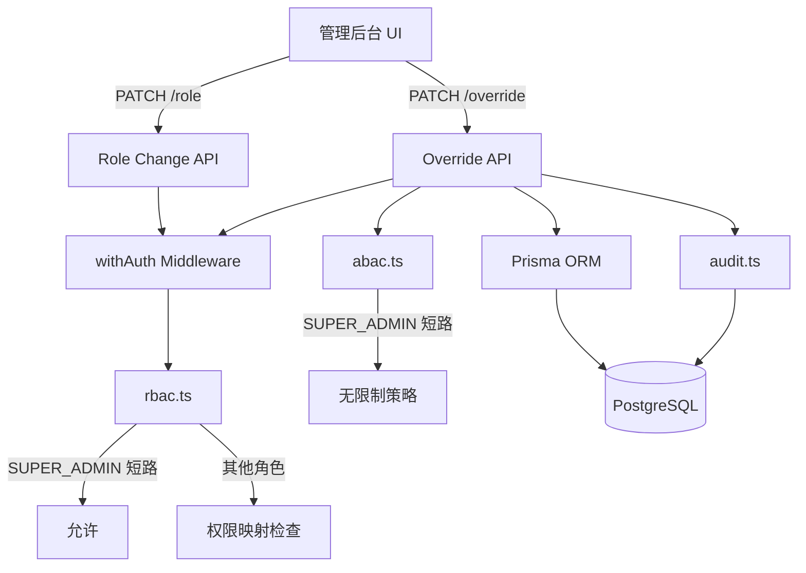

# 设计文档：超级管理员角色

## 概述

本设计为学生社区平台引入 `SUPER_ADMIN` 角色，作为系统最高权限角色。SUPER_ADMIN 可绕过所有 RBAC 和 ABAC 限制，直接修改任意用户属性，且所有操作均记录审计日志。

设计遵循现有架构模式：在 Prisma `Role` 枚举中新增值，扩展 `rbac.ts` 权限映射和层级，在 `abac.ts` 中添加角色短路逻辑，新增用户属性覆写 API 端点，并在管理后台 UI 中增加超级管理员专属编辑面板。

### 关键设计决策

1. **RBAC 短路而非穷举**：`checkPermission` 对 SUPER_ADMIN 直接返回 `true`，无需维护完整 Action 列表，确保未来新增 Action 时自动兼容。
2. **ABAC 角色前置检查**：`evaluateABACPolicy` 在计算属性限制前先检查角色，SUPER_ADMIN 直接返回无限制策略，避免属性值影响结果。
3. **独立覆写 API**：新增 `PATCH /api/admin/users/[id]/override` 端点，与现有 role change / ban 端点分离，职责清晰。
4. **自降级保护**：SUPER_ADMIN 不可降级自身角色，防止系统中无超级管理员。

## 架构



### 变更范围

| 层级 | 文件 | 变更类型 |
|------|------|----------|
| 数据层 | `prisma/schema.prisma` | 修改 - Role 枚举新增 SUPER_ADMIN |
| 权限层 | `src/lib/rbac.ts` | 修改 - 权限映射、层级、短路逻辑 |
| 权限层 | `src/lib/abac.ts` | 修改 - 策略评估短路 |
| 审计层 | `src/lib/audit.ts` | 修改 - 新增审计操作类型 |
| API 层 | `src/app/api/admin/users/[id]/role/route.ts` | 修改 - SUPER_ADMIN 授予/保护逻辑 |
| API 层 | `src/app/api/admin/users/[id]/override/route.ts` | 新增 - 属性覆写端点 |
| API 层 | `src/app/api/admin/users/route.ts` | 修改 - 查询 schema 支持 SUPER_ADMIN |
| UI 层 | `src/app/admin/users/page.tsx` | 修改 - 超级管理员编辑面板 |

## 组件与接口

### 1. Prisma Role 枚举扩展

在 `Role` 枚举末尾新增 `SUPER_ADMIN`：

```prisma
enum Role {
  USER
  TRUSTED_USER
  MODERATOR
  ADMIN
  DCR_HELPER
  SUPER_ADMIN
}
```

需要运行 `prisma migrate` 生成迁移文件。

### 2. RBAC 引擎扩展 (`src/lib/rbac.ts`)


#### 权限映射

```typescript
const SUPER_ADMIN_PERMISSIONS: ReadonlySet<Action> = new Set([
  ...ADMIN_PERMISSIONS,
  "handle_dcr_cases",
]);

export const ROLE_PERMISSIONS: Record<Role, ReadonlySet<Action>> = {
  // ... 现有角色 ...
  SUPER_ADMIN: SUPER_ADMIN_PERMISSIONS,
};
```

#### 角色层级

```typescript
const ROLE_LEVEL: Record<Role, number> = {
  USER: 0,
  TRUSTED_USER: 1,
  DCR_HELPER: 1,
  MODERATOR: 2,
  ADMIN: 3,
  SUPER_ADMIN: 4,
};
```

#### checkPermission 短路

```typescript
export function checkPermission(role: Role, action: Action, _resource?: Resource): boolean {
  if (role === "SUPER_ADMIN") return true;
  const permissions = ROLE_PERMISSIONS[role];
  if (!permissions) return false;
  return permissions.has(action);
}
```

### 3. ABAC 引擎扩展 (`src/lib/abac.ts`)

在 `evaluateABACPolicy` 函数开头添加 SUPER_ADMIN 短路：

```typescript
export function evaluateABACPolicy(user: ABACUserAttributes): ABACPolicyResult {
  if (user.role === "SUPER_ADMIN") {
    return {
      maxDailyPosts: null,
      canAccessPrivateZone: true,
      canSendDM: true,
      canAccessDCR: true,
      canAccessPsychology: true,
      isNewcomer: false,
      hasPassedQuiz: true,
      restrictions: [],
    };
  }
  // ... 现有逻辑不变 ...
}
```

同样在 `canCreatePost` 和 `canAccessZone` 中添加短路：

```typescript
export function canCreatePost(user: ABACUserAttributes, todayPostCount: number) {
  if (user.role === "SUPER_ADMIN") return { allowed: true };
  // ... 现有逻辑 ...
}

export function canAccessZone(user: ABACUserAttributes, zone: "PUBLIC" | "PSYCHOLOGY" | "DCR") {
  if (user.role === "SUPER_ADMIN") return { allowed: true };
  // ... 现有逻辑 ...
}
```

### 4. 审计日志扩展 (`src/lib/audit.ts`)

新增审计操作类型：

```typescript
export const AuditAction = {
  // ... 现有操作 ...
  SUPER_ADMIN_OVERRIDE: "SUPER_ADMIN_OVERRIDE",
} as const;
```

### 5. 用户属性覆写 API (`src/app/api/admin/users/[id]/override/route.ts`)

```typescript
// PATCH /api/admin/users/[id]/override
// 仅 SUPER_ADMIN 可调用
// 请求体：
interface OverrideBody {
  reputationScore?: number;
  violationCount?: number;
  psychAccess?: boolean;
  dcrAccess?: boolean;
  dcrPledgeSigned?: boolean;
  quizPassed?: boolean;
  onboardingDone?: boolean;
  role?: Role;
}
// 响应：{ user: UpdatedUser }
```

验证逻辑：
- `withAuth` 验证身份后，手动检查 `req.user.role === "SUPER_ADMIN"`
- 目标用户不存在返回 404
- 无有效字段返回 400
- 每个修改字段记录审计日志（含修改前后值）

### 6. 角色变更 API 扩展 (`src/app/api/admin/users/[id]/role/route.ts`)

修改现有端点：
- Zod schema 新增 `SUPER_ADMIN` 选项
- 当 `newRole === "SUPER_ADMIN"` 时，验证操作者也是 SUPER_ADMIN
- 当操作者尝试降级自身角色时返回 403
- SUPER_ADMIN 角色变更记录高优先级审计日志

### 7. 管理后台 UI 扩展 (`src/app/admin/users/page.tsx`)

- 角色筛选下拉框新增 SUPER_ADMIN 选项
- 角色变更下拉框新增 SUPER_ADMIN 选项（仅当前用户为 SUPER_ADMIN 时显示）
- 新增用户属性编辑面板（仅 SUPER_ADMIN 可见），包含：
  - reputationScore（数字输入）
  - violationCount（数字输入）
  - psychAccess / dcrAccess / dcrPledgeSigned / quizPassed / onboardingDone（开关）
- 提交前显示修改前后对比确认对话框

## 数据模型

### Role 枚举变更

```
现有: USER | TRUSTED_USER | MODERATOR | ADMIN | DCR_HELPER
新增: SUPER_ADMIN
```

### 用户模型（无结构变更）

`User` 模型无需新增字段。SUPER_ADMIN 的特殊行为完全通过 RBAC/ABAC 逻辑层实现，不依赖数据模型变更。

### 审计日志模型（无结构变更）

`AuditLog` 模型已支持 JSON `details` 字段，可存储覆写操作的前后值对比。新增的 `SUPER_ADMIN_OVERRIDE` 仅是 `action` 字段的新值，无需 schema 变更。

### 数据库迁移

需要一次 Prisma 迁移来更新 Role 枚举：

```sql
ALTER TYPE "Role" ADD VALUE 'SUPER_ADMIN';
```


## 正确性属性

*属性是在系统所有有效执行中都应成立的特征或行为——本质上是关于系统应该做什么的形式化陈述。属性是人类可读规范与机器可验证正确性保证之间的桥梁。*

### 属性 1：SUPER_ADMIN 通过所有 RBAC 权限检查

*对于任意* Action 类型，`checkPermission("SUPER_ADMIN", action)` 应返回 `true`。

**验证需求：2.1, 2.3**

### 属性 2：SUPER_ADMIN 满足所有角色等级要求

*对于任意* Role 值作为 `requiredRole` 参数，`hasMinimumRole("SUPER_ADMIN", requiredRole)` 应返回 `true`。

**验证需求：2.2**

### 属性 3：SUPER_ADMIN 绕过所有 ABAC 限制

*对于任意* ABAC 用户属性组合（任意 createdAt、violationCount、onboardingDone、quizPassed、psychAccess、dcrAccess、dcrPledgeSigned、reputationScore），只要 role 为 SUPER_ADMIN，`evaluateABACPolicy` 应返回 `maxDailyPosts` 为 null、`canAccessPrivateZone` 为 true、`canSendDM` 为 true、`canAccessDCR` 为 true、`canAccessPsychology` 为 true、`restrictions` 为空数组；且 `canCreatePost` 对任意 `todayPostCount` 返回 `allowed: true`；且 `canAccessZone` 对所有区域返回 `allowed: true`。

**验证需求：3.1, 3.2, 3.3**

### 属性 4：现有角色向后兼容

*对于任意* 现有角色（USER、TRUSTED_USER、DCR_HELPER、MODERATOR、ADMIN）和任意 Action，新增 SUPER_ADMIN 后 `checkPermission` 的返回值应与新增前一致。即现有角色的权限集合不受影响。

**验证需求：1.2**

### 属性 5：属性覆写 API 正确应用变更

*对于任意* 有效的覆写字段（reputationScore 为任意非负整数、violationCount 为任意非负整数、psychAccess/dcrAccess/dcrPledgeSigned/quizPassed/onboardingDone 为任意布尔值），当 SUPER_ADMIN 通过覆写 API 提交修改时，数据库中对应用户的字段值应更新为提交的值。

**验证需求：4.1, 4.2, 4.3, 4.4**

### 属性 6：覆写 API 仅限 SUPER_ADMIN 访问

*对于任意* 非 SUPER_ADMIN 角色（USER、TRUSTED_USER、DCR_HELPER、MODERATOR、ADMIN），调用覆写 API 应返回 403 状态码。

**验证需求：4.5**

### 属性 7：覆写操作审计日志完整性

*对于任意* 覆写操作，审计日志应包含操作者 ID、操作类型（SUPER_ADMIN_OVERRIDE）、目标用户 ID，以及每个被修改字段的修改前值和修改后值。

**验证需求：5.1, 5.3**

### 属性 8：非 SUPER_ADMIN 不可授予 SUPER_ADMIN 角色

*对于任意* 非 SUPER_ADMIN 角色的操作者，尝试将任意用户的角色设为 SUPER_ADMIN 时，系统应返回 403 状态码且目标用户角色不变。

**验证需求：7.1, 7.2**

## 错误处理

| 场景 | HTTP 状态码 | 错误消息 | 处理方式 |
|------|------------|----------|----------|
| 未登录用户访问覆写 API | 401 | 未登录 | withAuth 中间件拦截 |
| 非 SUPER_ADMIN 访问覆写 API | 403 | 权限不足 | 手动角色检查 |
| 非 SUPER_ADMIN 尝试授予 SUPER_ADMIN | 403 | 仅超级管理员可授予此角色 | 角色变更 API 中检查 |
| SUPER_ADMIN 尝试降级自身 | 403 | 不可降级自身角色 | 角色变更 API 中检查 |
| 目标用户不存在 | 404 | 用户不存在 | 数据库查询后检查 |
| 覆写请求体无有效字段 | 400 | 无有效修改字段 | Zod 验证 |
| 覆写字段值类型错误 | 400 | 参数校验失败 | Zod 验证 |
| 数据库操作失败 | 500 | 服务器内部错误 | try-catch 兜底 |

## 测试策略

### 属性测试（Property-Based Testing）

使用 `fast-check` 库，每个属性测试至少运行 100 次迭代。

测试标签格式：`Feature: super-admin-role, Property {N}: {描述}`

属性测试覆盖：
- 属性 1-4：在 `src/lib/__tests__/permissions.property.test.ts` 中扩展现有属性测试
- 属性 5-8：在 `src/app/api/admin/users/__tests__/override.property.test.ts` 中新增

生成器策略：
- 角色生成器：扩展现有 `arbRole` 包含 SUPER_ADMIN
- ABAC 用户生成器：扩展现有 `arbABACUser` 支持 SUPER_ADMIN 角色
- 覆写字段生成器：生成随机的 reputationScore（0-10000）、violationCount（0-100）、布尔属性组合

### 单元测试

单元测试覆盖具体示例和边界情况：

- `src/lib/__tests__/rbac.test.ts`：SUPER_ADMIN 权限映射、层级检查
- `src/lib/__tests__/abac.test.ts`：SUPER_ADMIN ABAC 绕过
- `src/app/api/admin/users/__tests__/role.test.ts`：SUPER_ADMIN 角色变更保护
- `src/app/api/admin/users/__tests__/override.test.ts`：覆写 API 端点测试
- `src/app/admin/__tests__/users-page.test.ts`：UI 条件渲染测试

每个属性测试必须由单个属性测试实现，标签引用设计文档中的属性编号。
